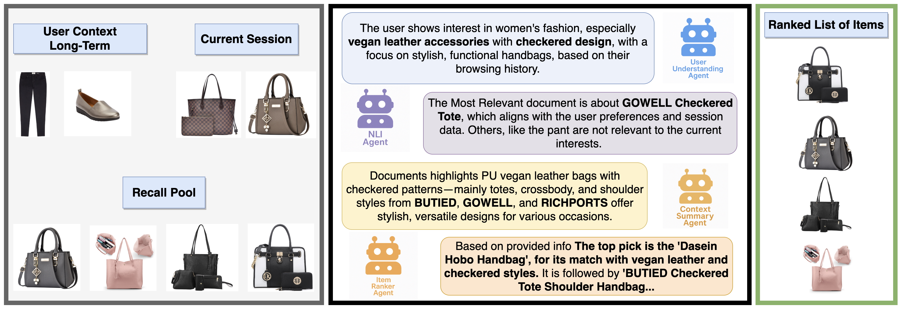

# RAG (Agentic RAG for RecSys)

**Nguồn:** [ARAG: Agentic Retrieval Augmented Generation for Personalized Recommendation](https://arxiv.org/abs/2506.21931) (arXiv: 2506.21931 - Tháng 6/2026)

---

## 1. Mục Tiêu của Bài Báo

Tác giả nhận định rằng hệ thống Retrieval-Augmented Generation (RAG) hiện tại trong Recommender Systems (RecSys) đang bị giới hạn bởi cơ chế truy xuất (Retrieval) quá đơn giản (chỉ dùng Cosine Similarity). Cosine Similarity không thể nắm bắt được "ngữ cảnh phức tạp" và "sự ưu tiên (preference)" của người dùng.

Để giải quyết vấn đề này, thay vì sửa đổi thuật toán truy xuất, tác giả dùng một hệ thống **Multi-Agent (Đa đặc vụ)** bằng LLM để đọc, tóm tắt và lọc lại các kết quả từ VectorDB.

---

## 2. Kiến Trúc của ARAG

Dưới đây là hình ảnh kiến trúc gốc trích xuất từ file LaTeX của tác giả:

### Quy trình hoạt động (Theo file `sample-base.tex`):

**Bước 1: Initial RAG (Truy xuất ban đầu)**
Hệ thống dùng Cosine Similarity truyền thống để lấy ra top-$k$ sản phẩm từ VectorDB:

$$
\mathcal{I}^0 = \mathrm{argtop}_{k} \Bigl\{ \mathrm{sim}\bigl(f_{\mathrm{Emb}}(i), f_{\mathrm{Emb}}(\mathbf{u})\bigr) \Bigr\}
$$

**Bước 2: NLI Agent (Đặc vụ Suy luận Ngôn ngữ)**
Một con LLM tên là NLI Agent sẽ đọc từng sản phẩm trong tập $\mathcal{I}^0$ và chấm điểm (Alignment Score $s_{NLI}$) xem sản phẩm đó có khớp với lịch sử người dùng không.

**Bước 3: Context Summary Agent (Đặc vụ Tóm tắt)**
Những item nào có điểm $s_{NLI} \ge \theta$ sẽ được con LLM này tóm tắt lại thành một đoạn văn ngắn ($S_{ctx}$).

**Bước 4: User Understanding Agent (Đặc vụ Hiểu Người dùng)**
Song song đó, một con LLM khác đọc toàn bộ lịch sử Dài hạn (Long-term) và Ngắn hạn (Short-term) của user để viết một đoạn văn tóm tắt Gu của người dùng ($S_{user}$).

**Bước 5: Item Ranker Agent (Đặc vụ Xếp hạng)**
Cuối cùng, một con LLM thứ 4 sẽ nhận vào đoạn văn $S_{ctx}$, đoạn văn $S_{user}$ và tập hợp các item để "suy luận" và xếp hạng lại (Reranking) chúng theo thứ tự khả năng mua hàng.

---

## 3. TẠI SAO PHƯƠNG PHÁP NÀY LÀ MỘT SỰ THẤT BẠI CỦA THIẾT KẾ HỆ THỐNG?

Dù đây là bài SOTA của năm 2026, nhưng từ góc độ của một System Architect (Kiến trúc sư hệ thống), kiến trúc này mắc phải những sai lầm chết người:

### Lỗi #1: Đánh rơi thông tin từ Database (The Retrieval Trap)

Trong **Bước 1**, tác giả vẫn dùng Cosine Similarity truyền thống mù thời gian để lấy ra $\mathcal{I}^0$.
Nếu món đồ $X$ là món đồ user *rất thích và vừa mới mua*, nhưng vì nó có Cosine Similarity thấp hơn món đồ $Y$ (mua từ 5 năm trước), $X$ sẽ bị loại khỏi $\mathcal{I}^0$.
Hệ quả: Các con Agent ở Bước 2, 3, 4, 5 có thông minh đến mấy cũng vô dụng vì $X$ đã biến mất từ vòng gửi xe. **Đây chính là việc cố gắng lấy LLM để sửa sai cho Database.**

### Lỗi #2: Bóp méo khái niệm Thời Gian (Time Mismatch)

Tác giả chia lịch sử thành $C_{lt}$ (Dài hạn) và $C_{st}$ (Ngắn hạn) rồi đưa cho `User Understanding Agent` đọc.
Agent này sẽ sinh ra một đoạn Text (Ví dụ: *"User thích túi da và đồ vintage"*). Khái niệm thời gian vật lý (khoảng cách 5 ngày, 3 tháng) bị san phẳng thành Text. LLM không hề được cung cấp một cơ sở toán học nào để hiểu sự suy giảm (decay) của sở thích theo thời gian thực.

### Lỗi #3: Chi phí Inference Khổng lồ (Unscalable Overhead)

Để Recommend cho **MỘT** user, hệ thống này phải gọi LLM tổng cộng **4 lần** (NLI, Context, User, Ranker).
Trên một hệ thống E-commerce thực tế với 100.000 users / giây, việc chạy Multi-Agent RAG như thế này sẽ làm sập toàn bộ hệ thống máy chủ. Đây là một kiểu "Khoe khoang Token" (Token-heavy flex) không thể đưa vào production.

---

## 4. TỪ ARAG, TẠI SAO `ChronoRoPE` CỦA CHÚNG TA LÀ ĐỘT PHÁ?

* **ARAG** giải quyết vấn đề bằng cách **TĂNG SỐ LƯỢNG LLM (Multi-Agent)** và dùng Text để diễn giải sở thích.
* **ChronoRoPE** giải quyết vấn đề bằng cách **CAN THIỆP VÀO CƠ CHẾ CHÚ Ý (Attention Core)** của một LLM duy nhất.
  Chúng ta không cần 4 con Agent ngồi đọc và tóm tắt lịch sử. Chúng ta nén "thời gian" thành một hàm MLP $\tau(t)$ và truyền nó trực tiếp vào trục quay của Transformer.
  - Lịch sử xa $\rightarrow$ Góc xoay lớn $\rightarrow$ Điểm Attention thấp $\rightarrow$ Bị quên lãng.
  - Thời gian tính bằng Toán học, inference chỉ chạy qua 1 con LLM duy nhất, tiết kiệm 90% chi phí so với ARAG.

ARAG là minh chứng rõ ràng nhất cho xu hướng "Over-engineering" (Làm phức tạp hóa vấn đề bằng cách đắp thêm LLM). ChronoRoPE của chúng ta sẽ là đòn đánh trực diện vào sự cồng kềnh này.
