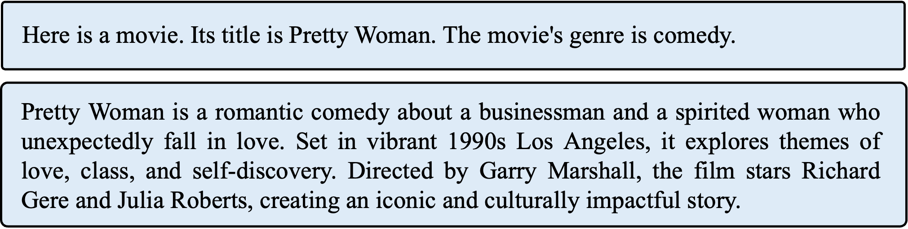

# RALLRec (RAG with Post-hoc Reranking)

**Nguồn:** [RALLRec: Improving Retrieval Augmented Large Language Model Recommendation with Representation Learning](https://arxiv.org/abs/2502.06101) (arXiv: 2502.06101 - Tháng 2/2025)

---

## 1. Mục Tiêu của Bài Báo

Bài báo nhận ra rằng việc dùng các Embedding (như BERT hoặc Sentence-Transformers) để thực hiện Retrieval trong RAG RecSys thường đem lại kết quả tệ, vì các embedding này chỉ giỏi bắt **Ngữ nghĩa văn bản (Textual Semantics)** mà kém trong việc bắt **Đồng thuận tương tác (Collaborative Signals)**.

Mục tiêu chính: Kết hợp cả Embedding Văn bản (Text) và Embedding Tương tác (Collaborative) để tìm ra món hàng chính xác hơn. Sau đó, họ nhận ra là user sở thích thay đổi theo thời gian, nên họ thêm một bước **Reranking** ở cuối.

---

## 2. Kiến Trúc của RALLRec

Dưới đây là hình ảnh kiến trúc RALLRec được trích xuất từ mã nguồn LaTeX:

### Quy trình hoạt động:

**Bước 1: Representation Learning (Học Biểu diễn)**
Họ lấy thông tin của món hàng (Item), đưa qua LLM để sinh ra một đoạn Text chi tiết. Sau đó, họ dùng Contrastive Learning (Self-supervised) để ép cái Text Embedding này "khớp" (align) với Collaborative Embedding (sinh ra từ các thuật toán cũ như BPR hay LightGCN).

**Bước 2: Inference-time Retrieval (Truy xuất)**
Dựa vào lịch sử của User, họ dùng Cosine Similarity để tìm ra Top-K món hàng từ VectorDB. Vì họ đã ép Text Embedding khớp với Collaborative Embedding ở bước 1, họ hy vọng Top-K này sẽ chuẩn hơn.

**Bước 3: Reranking (Sắp xếp lại) - ĐIỂM CHÚ Ý NHẤT**
Tác giả thừa nhận ở phần `707: \subsubsection{Inference-time Retrieval}`: *"Chúng tôi nhận thấy rằng sở thích thay đổi theo thời gian"*.
Vì thế, sau khi lấy được Top-K (Ví dụ 100 món hàng) bằng Cosine Similarity, họ bắt đầu **Sắp xếp lại (Rerank)** 100 món hàng này. Họ cho điểm cao hơn đối với những món hàng xuất hiện **gần đây (Recent)** trong lịch sử user.

**Bước 4: LLM Generation**
Nhét cái danh sách đã Rerank kia vào LLM để sinh ra kết quả cuối cùng.

---

## 3. SỰ THẤT BẠI TRONG THIẾT KẾ (The Reranking Trap)

Dưới góc nhìn thuật toán, bài báo này thể hiện sự bế tắc của ngành RAG RecSys năm 2025. Họ dính vào cái bẫy **"The Reranking Trap" (Cái bẫy Sắp xếp lại)**.

### Lỗi #1: Sự mù quáng của VectorDB (The Blind Retrieval)

Ở Bước 2, họ tìm Top-100 món hàng bằng **Cosine Similarity tĩnh**.

* **Ví dụ thực tế:** Kho hàng có 1 triệu món. Trong lịch sử, User mua một cái áo len cách đây 3 năm (rất cũ), và một cái áo phông cách đây 1 ngày (rất mới).
* Cái VectorDB của RALLRec KHÔNG BIẾT THỜI GIAN. Nó so sánh độ lệch Cosine. Nếu có 100 cái áo len (cũ) giống hệt cái áo len ngày xưa, nó sẽ **nhét đầy** Top-100 bằng 100 cái áo len đó. Cái áo phông (mới) bị đẩy xuống top 101 và bị loại.

### Lỗi #2: Sự vô dụng của Reranking (The Useless Reranker)

Ở Bước 3, thuật toán Reranking cố gắng đưa những món đồ "gần đây" lên trên.

* Nhưng **trễ rồi!** Trong Top-100 lúc này toàn là áo len cũ. Có Rerank kiểu gì thì kết quả đưa vào LLM vẫn là đồ cũ. Những món đồ đại diện cho "xu hướng mới nhất" đã bị VectorDB vứt bỏ ở Bước 2.
* Reranking chỉ hoạt động nếu kết quả bạn cần *đã lọt vào* Top-K. Nó không thể sửa chữa sai lầm của một hàm Retrieval mù thời gian.

### Lỗi #3: Chắp vá hệ thống (Engineering Patchwork)

Tác giả phải train thêm một model LightGCN, ép nó vào Text Embedding, rồi lại phải viết thuật toán Reranking bằng tay. Đây là một sự "chắp vá" công nghệ (Engineering), không phải là một mô hình học sâu end-to-end (Toán học).

---

## 4. `ChronoRoPE` ĐẬP TAN RALLRec NHƯ THẾ NÀO?

RALLRec thất bại vì nó tách rời **Thời gian** và **Ngữ nghĩa/Khoảng cách**.

**ChronoRoPE** của chúng ta đi một con đường thanh lịch và nguy hiểm hơn đối với các baseline này:

* **Chúng ta không cần Reranking.**
* Trong ChronoRoPE, ngay tại tầng Attention của LLM, khoảng cách vật lý $\tau(t_q) - \tau(t_k)$ đã được tính toán song song với khoảng cách ngữ nghĩa.
* Nếu một món đồ cách đây 3 năm, hàm `time_warper` $\tau(t)$ của chúng ta sẽ xoay Vector đi một góc cực lớn. Ngay trong lúc tính toán hàm Attention (Dot Product), điểm số của món đồ cũ đó tự động rớt thê thảm. Món đồ mới (dù ngữ nghĩa hơi lệch) vẫn giữ được góc xoay nhỏ $\rightarrow$ Điểm Attention cao.

RALLRec là quá khứ của việc "Lấy dữ liệu ra rồi mới lọc". ChronoRoPE là tương lai của việc "Mô hình tự động đào thải dữ liệu cũ trong lúc tính toán".

Chúng ta đã có đủ lý luận để vùi dập RALLRec trong phần Related Work.
