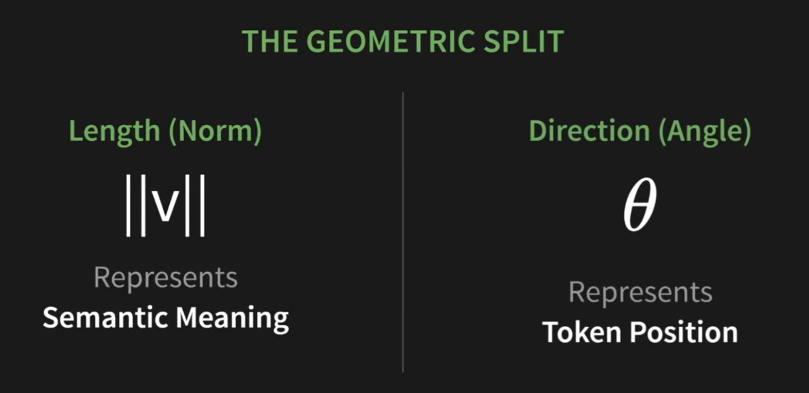
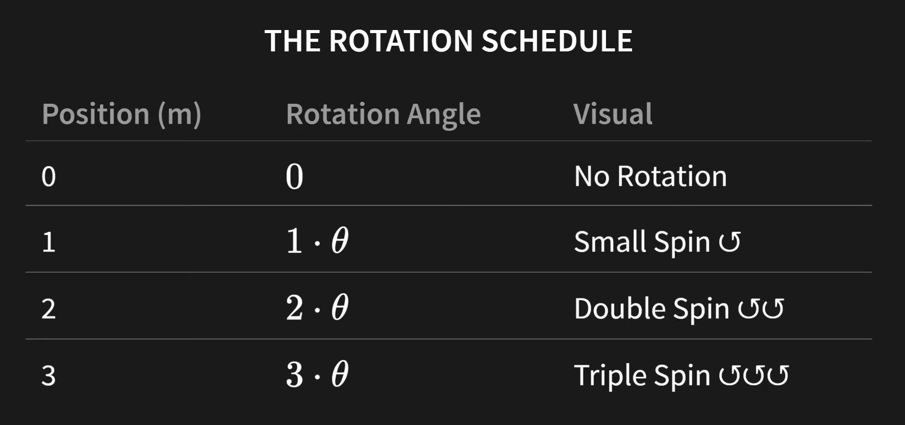
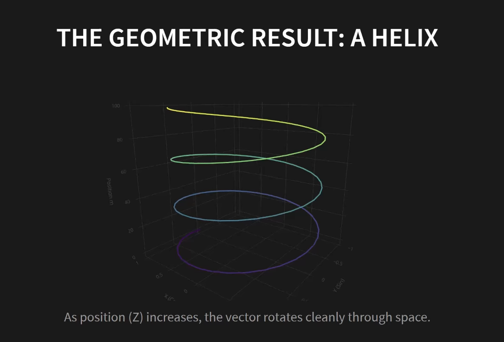
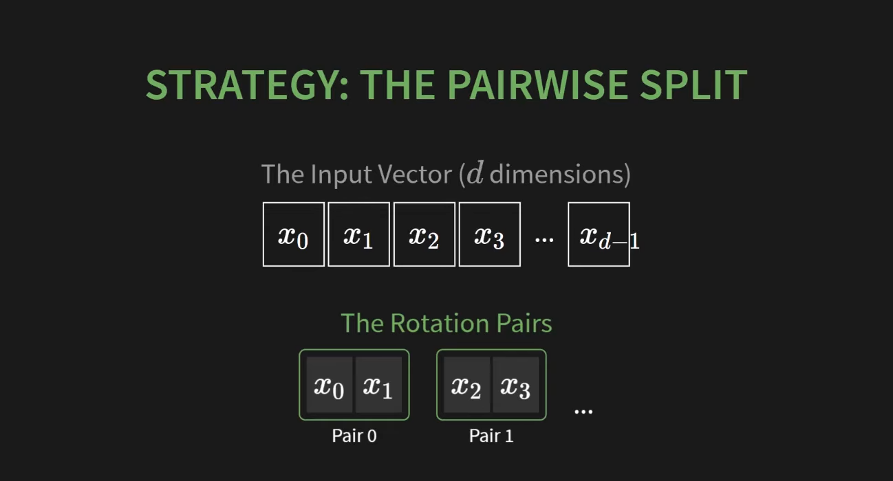
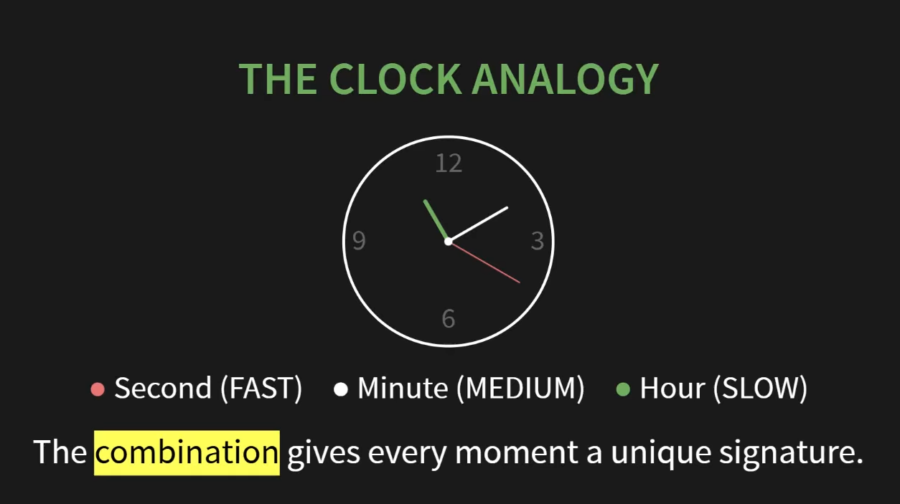
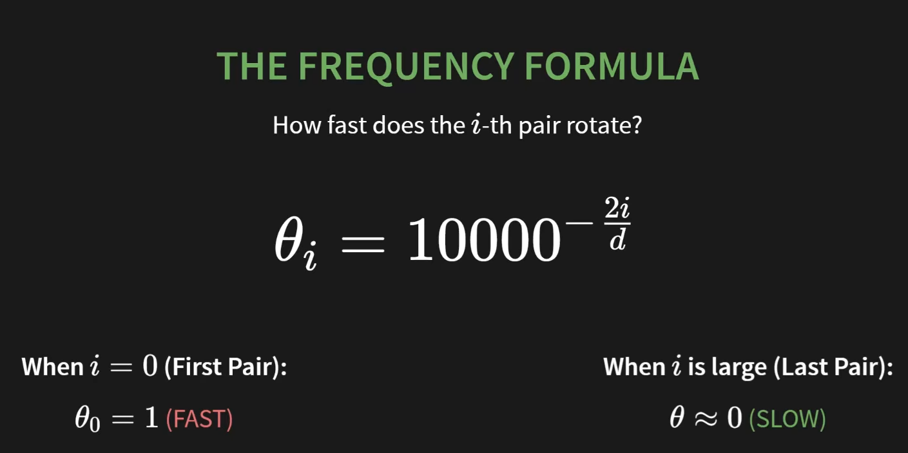
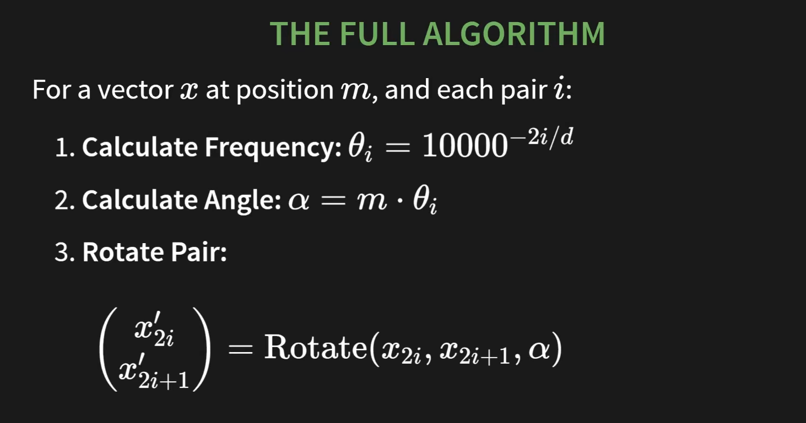

# RoPE (Rotary Position Embedding)

Để hiểu được vì sao ý tưởng *Personalized ChronoRoPE* của chúng ta lại khả thi và có sức mạnh lớn, chúng ta bắt buộc phải mổ xẻ **RoPE (Rotary Position Embedding)** ở mức độ toán học. Đây chính là "hệ điều hành" mà chúng ta sẽ nâng cấp.

## 0. Phân chia hình học

Chúng ta lấy một vector và chia các thuộc tính của nó làm 2 phần riêng biệt. Phần đầu tiên là độ dài của vector ||v|| -> thể hiện mặt ngữ nghĩa, phần thứ 2 là góc của vector -> giờ đây thể hiện về mặt vị trí 

=> Giờ đây chúng ta có thể thay đổi vị trí chỉ bằng cách thay đổi hướng mà không ảnh hưởng đến độ dài (hay ngữ nghĩa) 

## 1. Đừng CỘNG nữa, hãy XOAY!

RoPE được giới thiệu lần đầu trong mô hình RoFormer (2021) và nhanh chóng trở thành tiêu chuẩn vàng cho mọi mô hình LLM lớn nhất hiện nay (Llama, Gemma, Mistral).

Tư tưởng của RoPE rất thanh lịch: **Thay vì dùng phép CỘNG, hãy dùng phép XOAY (Rotation).**

Hãy tưởng tượng mặt phẳng không gian vector như một cái mặt đồng hồ.

- Vector `Query (Q)` và `Key (K)` của một món hàng giống như những chiếc kim đồng hồ.
- Vị trí của món hàng trong chuỗi (ví dụ: vị trí thứ $m$) sẽ quyết định chiếc kim đó bị **xoay đi một góc** là bao nhiêu.

## 2. Công thức Toán học của Phép Xoay

Để xoay một vector 2 chiều (2D) đi một góc $\theta$, toán học sử dụng một Ma trận xoay (Rotation Matrix):

$$
R(\theta) = \begin{pmatrix} \cos\theta & -\sin\theta \\ \sin\theta & \cos\theta \end{pmatrix}
$$

Để xoay bất kì vector v nào, ta chỉ cần nhân:

$$
v'= R(\theta) \times v 
$$

Làm sao ta biến đổi vị trí từ một số nguyên như 1, 2, 3 thành góc quay ?

Nếu món hàng nằm ở vị trí thứ $m$, góc xoay sẽ là $m\theta$. Vector Query $Q$ và Key $K$ tại vị trí $m$ và $n$ sẽ được biến đổi thành:

- $Q_{m} = Q \times R(m\theta)$
- $K_{n} = K \times R(n\theta)$

Nhưng nãy giờ chúng ta đang bàn tới việc xoay vector trong không gian 2D, tuy nhiên các mô hình LLM hiện nay như Llama-3 sử dụng vector có tới tận 4096 chiều 

-> Làm thế nào để xoay một vector có 4096 chiều ? Chúng ta không xoay 1 lần cả 4096 chiều mà sẽ làm 2048 lần xoay nhỏ sử dụng chiến lược chia theo cặp

Như hình trên, ta sẽ đi chia vector d chiều thành d/2 vector 2D. Vd: x0-x1 ; x2-x3 

Nhưng vấn đề nằm ở chỗ nếu tất cả chúng đều quay với cùng tốc độ thì kết qủa hoàn toàn không rõ ràng/ không đưa cho chúng ta được thông tin hữu ích gì

=> Chúng ta cần một cách để đảm bảo mỗi cặp đều có một góc quay chuyên biệt

Ý tưởng này đến từ một chiếc đồng hồ. Kim giây chạy nhanh, kim phút chạy vừa phải còn kim giờ thì chạy chậm. Chúng đều quay, nhưng với tốc độ khác nhau, và tại sao điều này lại quan trọng ?

=> Chính sự kết hợp của những tốc độ khác nhau đó tạo nên dấu ấn riêng biệt cho từng khoảnh khắc.

RoPE sử dụng chính ý tưởng này -> Mỗi cặp chiều là một cây kim quay với tốc độ khác nhau, cặp đầu tiên như kim giây quay nhanh, cặp thứ hai như kim phút, những cặp cuối cùng thì quay rất chậm như kim giờ. Vậy thì làm sao kiểm soát được tốc độ đó ? 

Đây là công thức tính tần số hay tốc độ quay của mỗi kim thứ i -> i càng lớn thì tần số càng nhỏ dần về 0 -> quay chậm dần 

Không có tham số, không cần huấn luyện, thuần toán 

## 3. Điều Kỳ Diệu Của Phép Nhân Vô Hướng (Dot Product)

Điều làm nên sự thành công của RoPE không chỉ nằm ở việc nó xoay vector. Điểm "ăn tiền" nhất nằm ở khoảnh khắc **khi cơ chế Attention tính Tích vô hướng (Dot Product) giữa Q và K.**

Trong toán học lượng giác, khi bạn lấy một vector bị xoay góc $(m\theta)$ nhân vô hướng với một vector bị xoay góc $(n\theta)$, kết quả sẽ triệt tiêu các góc quay tuyệt đối $m$ và $n$, mà chỉ để lại **Hiệu số của hai góc xoay**:

$$
Q_m \cdot K_n = (Q \times R(m\theta)) \cdot (K \times R(n\theta)) = (Q \cdot K) \times \cos((m - n)\theta) + \dots
$$

1. Kết quả (Attention Score) giờ đây tự động chứa giá trị $(m - n)$. Nghĩa là mô hình đã **tự nhận biết được khoảng cách tương đối** giữa 2 món hàng! Nó biết chính xác Món n cách Món m bao nhiêu bước.
2. Phép xoay không làm thay đổi độ dài của vector, do đó nó **bảo toàn hoàn toàn** tính chất gốc của Item Embedding (không bị nhiễu như phép CỘNG).

More proof why this work: [www.youtube.com/watch?v=hCzJo4ui1P8&amp;t=1382s](https://www.youtube.com/watch?v=hCzJo4ui1P8&t=1382s)

## 4. Tại sao đây là Bệ phóng cho Ý tưởng của chúng ta?

Khi nhìn vào công thức góc xoay của RoPE: **$\text{Góc} = m \times \theta$**

- $m$: Là vị trí tuyệt đối của món hàng (Index: 1, 2, 3...).
- $\theta$: Là tần số cơ sở (Base Frequency).

**Sự giác ngộ:**
Toàn bộ giới NLP và các mô hình LLM dùng Index $m$ vì các từ trong câu cách đều nhau.
Nhưng trong Recommender Systems (Gợi ý mua sắm), khoảng cách giữa món hàng thứ 1 và thứ 2 có thể là 1 ngày, trong khi khoảng cách giữa thứ 2 và thứ 3 có thể là 1 tháng! Nếu vẫn dùng $m$ (1, 2, 3), mô hình sẽ tiếp tục coi 1 ngày và 1 tháng là "cách nhau 1 bước".

👉 *Chúng ta phải thay thế $m$ (Index) bằng $t$ (Thời gian thực - Timestamp)!*

Và đó chính là nền tảng của các bài báo **RoTE** và **TO-RoPE** gần đây. Tuy nhiên, họ lại tiếp tục mắc một sai lầm chết người khác. Chúng ta sẽ "bắt thóp" họ ở **Hồi 4**.
