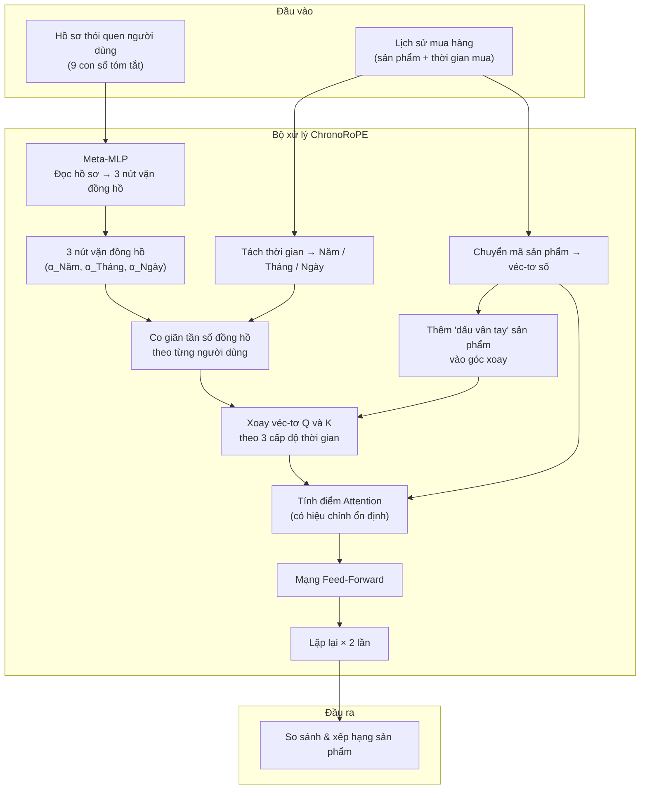
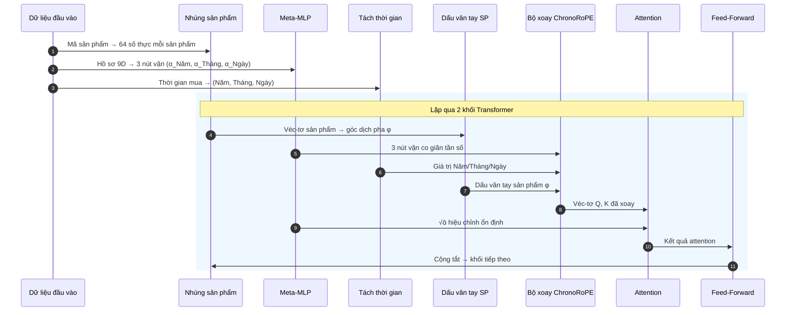

# ChronoRoPE — Kiến trúc Hệ thống

## 1. ChronoRoPE là gì?

Hãy tưởng tượng bạn đang xây dựng một hệ thống gợi ý sản phẩm (như Amazon, Shopee). Hệ thống cần trả lời câu hỏi: **"Người dùng này sẽ mua gì tiếp theo?"**

Các mô hình truyền thống (như SASRec) chỉ nhìn vào **thứ tự** sản phẩm đã mua (món 1, món 2, món 3...) mà bỏ qua **khi nào** người dùng mua chúng. Nhưng thời gian rất quan trọng! Mua 3 món trong 1 ngày khác hoàn toàn với mua 3 món rải rác trong 3 tháng.

**RoTE** (SIGIR 2026) giải quyết vấn đề này bằng cách mã hóa thời gian vào mô hình qua phép xoay (rotation). Nhưng RoTE dùng cùng một cách mã hóa cho tất cả người dùng — trong khi mỗi người có nhịp mua sắm riêng.

**ChronoRoPE** mở rộng RoTE bằng 3 ý tưởng chính:

1. **Điều chỉnh "đồng hồ" riêng cho từng người dùng** — Một mạng nhỏ (Meta-MLP) học cách co giãn tốc độ đồng hồ Năm/Tháng/Ngày phù hợp với nhịp mua sắm của từng người.
2. **Kết hợp thông tin sản phẩm vào thời gian** — Hai sản phẩm cùng loại (ví dụ: bàn phím + chuột gaming) được kéo "gần nhau" trong không gian attention, dù có thể mua cách nhau nhiều ngày.
3. **Ổn định hệ thống khi đồng hồ thay đổi** — Khi co giãn đồng hồ, các con số bên trong mô hình có thể bị lệch. ChronoRoPE tự động điều chỉnh lại để giữ ổn định.

---

## 2. Sơ đồ tổng thể

### oPE và toánGiải thích từng bước:

1. **Đầu vào**: Hệ thống nhận danh sách sản phẩm đã mua kèm thời điểm mua, cùng với hồ sơ 9 con số tóm tắt thói quen người dùng.
2. **Chuyển mã sản phẩm → véc-tơ số (Node C)**: Mỗi sản phẩm (ví dụ: "Bàn phím cơ") được chuyển thành một dãy 64 số thực. Dãy số này được nhân với $\sqrt{64} = 8$ để cân bằng biên độ — giống như chỉnh âm lượng micro trước khi thu âm, đảm bảo tiếng nói (thông tin sản phẩm) không bị nhỏ hơn tiếng nhạc nền (thông tin thời gian).
3. **Meta-MLP đọc hồ sơ → 3 nút vặn (Node D → F)**: Mạng Meta-MLP đọc 9 con số mô tả thói quen người dùng, rồi xuất ra 3 "nút vặn" $(\alpha_{\text{Năm}}, \alpha_{\text{Tháng}}, \alpha_{\text{Ngày}})$. Mỗi nút vặn quyết định đồng hồ ở cấp độ đó cần chạy nhanh hay chậm.
4. **Tách thời gian (Node E)**: Mốc thời gian được quy đổi sang 3 đơn vị: bao nhiêu năm, bao nhiêu tháng, bao nhiêu ngày kể từ lần mua đầu tiên.
5. **Co giãn tần số + Xoay véc-tơ (Node H → I)**: Dùng 3 nút vặn để điều chỉnh tần số xoay, sau đó xoay các véc-tơ Query và Key theo 3 cấp độ thời gian rồi cộng lại.
6. **Thêm đặc trưng sản phẩm (Node G)**: Trước khi xoay, mô hình thêm một "dấu vân tay" nhỏ phụ thuộc vào loại sản phẩm, để các sản phẩm cùng loại có góc xoay gần nhau hơn.
7. **Tính Attention có hiệu chỉnh (Node J)**: Tính điểm chú ý giữa các sản phẩm, có chia thêm cho $\sqrt{\bar{\alpha}}$ để giữ ổn định khi đồng hồ bị co giãn.
8. **Lặp lại 2 lần (Node K → L)**: Toàn bộ quá trình trên được lặp qua 2 khối Transformer để trích xuất đặc trưng sâu hơn.

---

## 3. Cách xử lý dữ liệu đầu vào

### 3.1. Chuyển đổi thời gian: Từ "ngày tháng tuyệt đối" sang "bao lâu kể từ lần mua đầu"

Thay vì dùng thời gian tuyệt đối (ví dụ: "13/09/2020"), tính **thời gian tương đối** — tức là bao nhiêu giây kể từ lần mua hàng đầu tiên của chính người dùng đó.

$$
t_{\text{tương đối}} = t_{\text{tuyệt đối}} - t_{\text{lần mua đầu tiên}}
$$

> **Tại sao?** Nếu dùng thời gian tuyệt đối, hai người dùng có hành vi giống hệt nhau nhưng đăng ký khác năm sẽ bị mô hình coi là khác nhau. Chuyển sang thời gian tương đối giúp mô hình chỉ tập trung vào **khoảng cách** giữa các lần mua, không bị ảnh hưởng bởi việc ai đăng ký trước ai.

#### Ví dụ:

Người dùng A mua 3 sản phẩm:

- Lần 1: timestamp = `1,600,000,000` → **t = 0 giây** (điểm bắt đầu)
- Lần 2: timestamp = `1,600,086,400` → **t = 86,400 giây** (sau đúng 1 ngày)
- Lần 3: timestamp = `1,602,592,000` → **t = 2,592,000 giây** (sau đúng 30 ngày)

Sau đó, thời gian tương đối được tách thành 3 "ống kính" nhìn ở các mức khác nhau:

| Lần mua | Ngày      | Tháng       | Năm       |
| -------- | ---------- | ------------ | ---------- |
| Lần 1   | 0.0 ngày  | 0.0 tháng   | 0.0 năm   |
| Lần 2   | 1.0 ngày  | 0.033 tháng | 0.003 năm |
| Lần 3   | 30.0 ngày | 0.986 tháng | 0.082 năm |

Cách tính: `ngày = giây / 86400`, `tháng = ngày / 30.4375`, `năm = ngày / 365.25`.

### 3.2. Hồ sơ thói quen người dùng (9 con số)

Từ lịch sử mua hàng, chúng tôi rút trích 9 con số tóm tắt "nhịp mua sắm" của mỗi người:

| STT | Tên                      | Ý nghĩa dễ hiểu                          |  Ví dụ Gamer (A)  | Ví dụ Buyer mùa vụ (B) |
| :-: | ------------------------- | -------------------------------------------- | :-----------------: | :------------------------: |
|  0  | Mật độ tổng thể      | Trung bình bao lâu mua 1 món?             |     Cao (+1.85)     |       Thấp (-1.20)       |
|  1  | Mật độ gần đây      | Gần đây có mua dồn dập không?         |  Rất cao (+2.10)  |     Rất thấp (-1.50)     |
|  2  | Khoảng dừng trung bình | Trung bình nghỉ bao lâu giữa 2 lần mua? |    Ngắn (-1.45)    |        Dài (+2.10)        |
|  3  | Độ đều đặn          | Mua đều đặn hay thất thường?          | Đều đặn (-1.20) |   Thất thường (+1.90)   |
|  4  | Khoảng nghỉ dài nhất  | Lần nghỉ lâu nhất là bao lâu?          |    Ngắn (-0.90)    |     Rất dài (+2.50)     |
|  5  | Số lần mua              | Đã mua bao nhiêu món?                    |   Nhiều (+1.50)   |        Ít (-0.80)        |
|  6  | Độ mới                 | Lần mua cuối gần đây hay lâu rồi?     | Gần đây (+0.95) |   Bình thường (+0.30)   |
|  7  | Giờ mua (sin)            | Hay mua lúc mấy giờ? (phần sin)          |  Tối 21h (-0.71)  |      Trưa 12h (0.00)      |
|  8  | Giờ mua (cos)            | Hay mua lúc mấy giờ? (phần cos)          |  Tối 21h (+0.71)  |     Trưa 12h (-1.00)     |

> **Các con số dương (+)** nghĩa là cao hơn mức trung bình của tất cả người dùng. **Các con số âm (-)** nghĩa là thấp hơn trung bình. Đây là kết quả của phép chuẩn hóa Z-score: $z = \frac{\text{giá trị thô} - \text{trung bình}}{\text{độ lệch chuẩn}}$.

#### Giải thích chi tiết cho hai người dùng mẫu:

**Người dùng A — Gamer mua game/phụ kiện liên tục hàng ngày ($n=45$ sản phẩm):**

- Chiều 0 (+1.85): Mua 45 món trong 100 giờ = 0.45 món/giờ. Người bình thường chỉ mua 0.02 món/giờ → mật độ gấp 22 lần trung bình → Z-score dương rất lớn.
- Chiều 2 (-1.45): Khoảng dừng trung bình giữa 2 lần mua chỉ 1.5 giờ, trong khi trung bình hệ thống là 48 giờ → thấp hơn trung bình rất nhiều → Z-score âm sâu.
- Chiều 7 & 8 (-0.71, +0.71): Lần mua cuối lúc 21:00 tối. $\sin(2\pi \times 21/24) = -0.71$, $\cos(2\pi \times 21/24) = +0.71$. Hai chiều sin/cos mã hóa giờ trong ngày thành vòng tròn (tránh vấn đề 23:59 gần 00:00 mà số thẳng không thể hiện được).

**Người dùng B — Buyer mùa vụ, mua quà dịp lễ ($n=6$ sản phẩm):**

- Chiều 0 (-1.20): Chỉ mua 6 món rải rác cả năm → mật độ thưa thớt → Z-score âm lớn.
- Chiều 2 (+2.10): Khoảng dừng trung bình tới 45 ngày giữa hai lần mua → cao hơn trung bình rất nhiều → Z-score dương lớn.
- Chiều 4 (+2.50): Có khoảng nghỉ kéo dài tới 180 ngày (nửa năm!) giữa hai đợt mua → cực kỳ cao → Z-score dương lớn nhất.
- Chiều 7 & 8 (0.00, -1.00): Lần mua cuối lúc 12:00 trưa. $\sin(2\pi \times 12/24) = \sin(\pi) = 0$, $\cos(2\pi \times 12/24) = \cos(\pi) = -1$.

---

## 4. Ba mô hình được so sánh

### 4.1. SASRec Baseline — Chỉ dùng thứ tự, bỏ qua thời gian

Mô hình SASRec gốc gán cho mỗi vị trí trong chuỗi một mã vị trí cố định (vị trí 0, 1, 2, ..., 49). Nó biết "sản phẩm này đứng thứ 3 trong danh sách" nhưng **không biết** sản phẩm thứ 2 và thứ 3 được mua cách nhau 2 giờ hay 2 tháng.

### 4.2. SASRec + RoTE — Thêm đồng hồ thời gian, nhưng giống nhau cho mọi người

RoTE (SIGIR 2026) thay mã vị trí bằng **phép xoay dựa trên thời gian thực**. Mỗi lần mua được mã hóa bằng 3 tầng xoay: Năm, Tháng, Ngày, với tần số cố định:

| Tầng  | Tần số cơ sở | Trọng số | Nắm bắt điều gì?          |
| ------ | ---------------- | ---------- | ------------------------------ |
| Năm   | 1,000,000        | 1.5        | Xu hướng dài hạn, mùa vụ |
| Tháng | 10,000           | 1.0        | Chu kỳ trung hạn             |
| Ngày  | 100              | 0.5        | Hành vi ngắn hạn gần đây |

Ưu điểm: Mô hình giờ đã biết "sản phẩm A mua trước sản phẩm B đúng 30 ngày".
Nhược điểm: Tần số cố định giống nhau cho mọi người — gamer mua hàng ngày và người mua theo mùa đều bị ép dùng cùng một "đồng hồ".

---

### 4.3. SASRec + ChronoRoPE  — Đồng hồ cá nhân hóa (đề xuất của chúng ta)

ChronoRoPE thêm 3 cải tiến trên nền RoTE:

#### Cải tiến 1: Mỗi người dùng có "nút vặn đồng hồ" riêng (Per-Level NTK Scaling)

##### Ý tưởng cốt lõi:

Hãy tưởng tượng RoPE như một **đồng hồ nhiều kim**. Kim giờ quay chậm (nắm bắt xu hướng dài hạn), kim phút quay nhanh hơn (chu kỳ trung hạn), kim giây quay nhanh nhất (thứ tự ngắn hạn).

Nếu bạn muốn đồng hồ bao phủ khoảng thời gian dài hơn (ví dụ: 1 năm thay vì 1 tháng), cách đơn giản nhất là **kéo giãn tất cả các kim** ra — nhưng làm vậy thì kim giây cũng chậm lại, mất khả năng phân biệt giây nào với giây nào.

**NTK Scaling** giải quyết điều này thông minh hơn: nó **chỉ kéo giãn kim giờ** (tầng thấp) trong khi **giữ nguyên kim giây** (tầng cao). Về mặt toán học:

$$
\theta_i(\alpha) = \frac{1}{(\text{base} \times \alpha)^{2i/d}}
$$

- Khi $i = 0$ (kim giây — tần số cao): $(\text{base} \times \alpha)^0 = 1$ → **không thay đổi gì cả**. Thứ tự ngắn hạn được bảo toàn 100%.
- Khi $i$ lớn (kim giờ — tần số thấp): $(\text{base} \times \alpha)^1 = \text{base} \times \alpha$ → **được kéo giãn tối đa**. Bộ nhớ dài hạn được mở rộng.

##### Trong ChronoRoPE:

Mạng Meta-MLP đọc hồ sơ 9 con số của từng người dùng, rồi xuất ra **3 nút vặn riêng biệt**:

$$
(\alpha_{\text{Năm}}, \alpha_{\text{Tháng}}, \alpha_{\text{Ngày}}) = \text{softplus}(\text{MLP}(\text{hồ sơ 9D})) + 0.1
$$

Mỗi nút vặn điều chỉnh tần số của tầng tương ứng:

$$
\theta_{\text{tầng}}^{(i)}(\text{người dùng}) = \frac{1}{(\text{base}_{\text{tầng}} \times \alpha_{\text{tầng}})^{2i/d}}
$$

##### Ví dụ thực tế:

- **Gamer (Người dùng A)** — Meta-MLP xuất ra: $(\alpha_y = 1.02, \alpha_m = 1.15, \alpha_d = 3.80)$

  - $\alpha_d = 3.80$ → Tần số Ngày: $\text{base}_d \times \alpha_d = 100 \times 3.80 = 380$. Đồng hồ ngày quay **chậm hơn 3.8 lần**, giúp phân biệt rõ ràng các lần mua cách nhau 2 giờ, 6 giờ hay 12 giờ trong cùng 1 ngày mà không bị lẫn lộn.
  - $\alpha_y = 1.02$ → Tần số Năm hầu như giữ nguyên. Gamer mua liên tục nên không cần mở rộng bộ nhớ năm.
- **Buyer mùa vụ (Người dùng B)** — Meta-MLP xuất ra: $(\alpha_y = 4.50, \alpha_m = 1.80, \alpha_d = 1.05)$

  - $\alpha_y = 4.50$ → Tần số Năm: $\text{base}_y \times \alpha_y = 10^6 \times 4.50 = 4.5 \times 10^6$. Đồng hồ năm quay **chậm hơn 4.5 lần**, giúp mô hình nhớ được xu hướng mua sắm kéo dài 1-2 năm mà không bị "quên" hay tràn pha.
  - $\alpha_d = 1.05$ → Tần số Ngày hầu như giữ nguyên. Buyer mùa vụ ít cần phân biệt chi tiết trong ngày.

#### Cải tiến 2: Thêm "dấu vân tay" sản phẩm vào thời gian (Content-Aware Phase Shift)

##### Ý tưởng cốt lõi:

Trong RoTE gốc, khoảng cách attention giữa hai sản phẩm **chỉ phụ thuộc vào thời gian** mua chúng. Nhưng điều này chưa đủ — hai sản phẩm cùng loại (bàn phím + chuột) nên được "kéo gần nhau" hơn trong attention, dù mua cách nhau nhiều ngày.

ChronoRoPE thêm một góc dịch pha nhỏ ($\phi$) phụ thuộc vào bản thân sản phẩm:

$$
\text{Góc xoay hiệu dụng} = \underbrace{t \times \theta}_{\text{phần thời gian}} + \underbrace{\phi}_{\text{dấu vân tay sản phẩm}}
$$

Khi tính attention giữa sản phẩm $i$ và $j$, góc lệch là:

$$
\Delta\theta = (t_i - t_j) \times \theta + (\phi_i - \phi_j)
$$

- Nếu hai sản phẩm cùng loại: $\phi_i \approx \phi_j \rightarrow \phi_i - \phi_j \approx 0$ → Attention **cao**.
- Nếu hai sản phẩm khác loại: $\phi_i \neq \phi_j$ → Góc lệch thêm bị đẩy ra → Attention **thấp**.

##### Ví dụ thực tế:

Ba sản phẩm:

- **Bàn phím cơ Gaming** ($i_1$)
- **Chuột chơi game** ($i_2$) — cùng danh mục Gaming
- **Nước giặt quần áo** ($i_3$) — khác danh mục hoàn toàn

Cả $i_2$ và $i_3$ đều được mua sau $i_1$ **đúng 7 ngày**:

- **Bàn phím → Chuột**: Cùng loại Gaming nên $\phi_1 \approx \phi_2$. Góc lệch chỉ phụ thuộc thời gian thuần túy → Attention **cao (~0.82)**, mô hình hiểu đây là cặp sản phẩm bổ trợ.
- **Bàn phím → Nước giặt**: Khác loại hoàn toàn nên $\phi_1 - \phi_3$ lớn. Góc lệch bị đẩy xa thêm → Attention **thấp (~0.11)**, mô hình hiểu đây chỉ là trùng hợp thời gian, không phải sở thích liên quan.

> **Lưu ý:** Ma trận $W_{\text{phase}}$ được khởi tạo bằng 0, nên ban đầu mô hình hoạt động **y hệt** RoTE gốc. Dấu vân tay sản phẩm chỉ xuất hiện dần dần qua quá trình học.

#### Cải tiến 3: Tự động ổn định khi đồng hồ thay đổi (Temperature Correction)

##### Ý tưởng cốt lõi:

Khi co giãn tần số đồng hồ (qua $\alpha$), các con số bên trong tích $Q \times K^T$ có thể bị phình to hoặc thu nhỏ. Điều này khiến hàm Softmax bị lệch:

- Nếu $\alpha$ lớn → các con số nhỏ đi → Softmax trở nên "phẳng" (mô hình không biết chú ý vào đâu).
- Nếu $\alpha$ nhỏ → các con số lớn lên → Softmax trở nên "nhọn" quá (mô hình quá tự tin vào 1 sản phẩm).

ChronoRoPE tự động chia thêm cho $\sqrt{\bar{\alpha}}$ (trung bình 3 nút vặn) để triệt tiêu hiệu ứng này:

$$
\text{Attention} = \text{softmax}\left(\frac{Q K^T}{\underbrace{\sqrt{d_h}}_{\text{chuẩn}} \times \underbrace{\sqrt{\bar{\alpha}}}_{\text{hiệu chỉnh}}}\right) V
$$

##### Ví dụ tính toán:

Với Gamer (Người dùng A) có $(\alpha_y = 1.02, \alpha_m = 1.15, \alpha_d = 3.80)$:

- Trung bình: $\bar{\alpha} = \frac{1.02 + 1.15 + 3.80}{3} = 1.99$
- Hệ số hiệu chỉnh: $\sqrt{1.99} = 1.41$
- Thay vì chia cho $\sqrt{64} = 8$ (như thông thường), ChronoRoPE chia cho $8 \times 1.41 = 11.28$.
- **Kết quả:** Softmax vẫn duy trì "độ nhọn" vừa phải, mô hình không bị mất phương hướng dù đồng hồ Ngày được kéo giãn gấp 3.8 lần.

---

## 5. Luồng xử lý từng bước (Forward Pass)

### Giải thích:

1. **Bước 1**: Chuyển mã sản phẩm thành véc-tơ 64 chiều.
2. **Bước 2**: Meta-MLP đọc hồ sơ người dùng, xuất 3 nút vặn.
3. **Bước 3**: Tách thời gian mua thành Năm/Tháng/Ngày.
4. **Bước 4-8 (lặp 2 lần)**: Xoay véc-tơ Q và K theo thời gian (có co giãn theo người dùng và dịch pha theo sản phẩm), tính attention có hiệu chỉnh, đưa qua Feed-Forward.

---

## 6. Thống kê & Cấu hình

### 6.1. Chi phí thêm của ChronoRoPE so với RoTE

| Thành phần thêm                 |    Số tham số | Ghi chú                                |
| ---------------------------------- | --------------: | --------------------------------------- |
| Meta-MLP (9 → 32 → 16 → 3)      |             899 | Dự đoán 3 nút vặn từ hồ sơ 9D   |
| Dấu vân tay sản phẩm (2 khối) |           4,096 | Ma trận chiếu$W_{\text{phase}}$     |
| **Tổng thêm**              | **4,995** | **Chỉ tăng ~0.6%** so với RoTE |

> ChronoRoPE chỉ bổ sung **~5,000 tham số** (0.6%) — một chi phí cực kỳ nhỏ để đổi lấy khả năng cá nhân hóa đồng hồ thời gian cho mỗi người dùng.

### 6.2. Cấu hình huấn luyện

| Thiết lập                | Giá trị                                                    |
| -------------------------- | ------------------------------------------------------------ |
| Kích thước véc-tơ ẩn | 64                                                           |
| Số khối Transformer      | 2                                                            |
| Số đầu Attention        | 1                                                            |
| Độ dài chuỗi tối đa  | 50 sản phẩm                                                |
| Batch size                 | 512                                                          |
| Tốc độ học             | 0.001 (Adam)                                                 |
| Dropout                    | 0.5                                                          |
| Số epoch                  | 1000                                                         |
| Đánh giá                | Full-Catalog (xếp hạng trên toàn bộ ~12,000 sản phẩm) |
| Độ đo                   | Recall@5, Recall@10, NDCG@5, NDCG@10                         |
