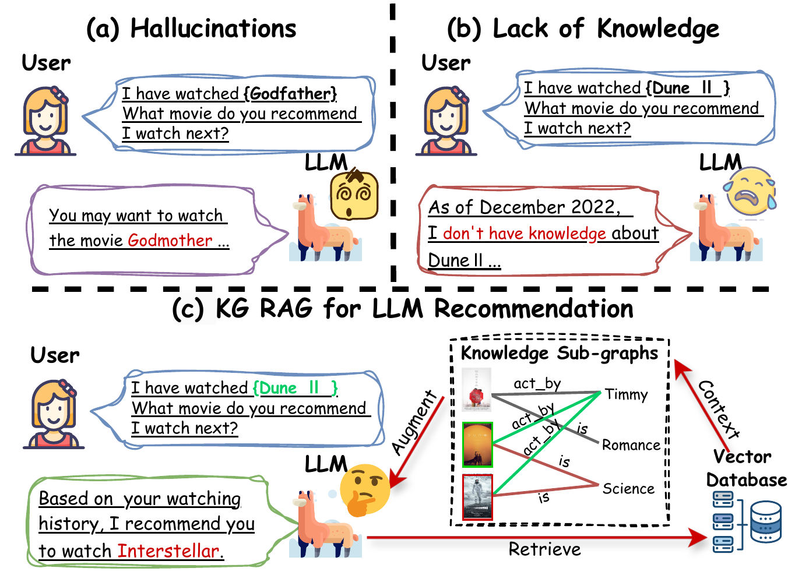
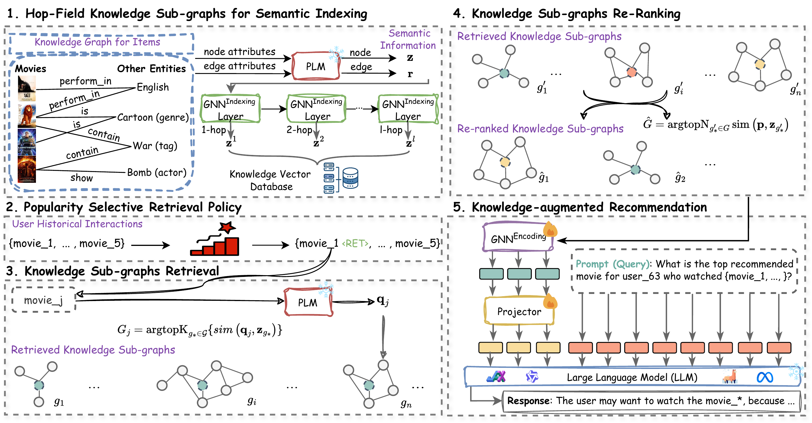

# K-RAGRec: Knowledge Graph Retrieval-Augmented Generation

K-RAGRec giải quyết trực diện điểm yếu "chí mạng" của LLMs khi áp dụng vào lĩnh vực Thương mại điện tử và Gợi ý: **Sự ảo giác (Hallucinations) và Mù mờ thông tin cục bộ.**

---

## 1. Bản chất của Vấn đề và Giải pháp K-RAG

Để hiểu tại sao K-RAGRec ra đời, hãy nhìn vào sự khác biệt khi hỏi LLM một câu thông thường so với khi trang bị cho nó một Đồ thị Tri thức (KG).

*Hình 1: Minh họa vấn đề Ảo giác (Hallucination) và thiếu hụt kiến thức đặc thù lĩnh vực của LLM, và cách K-RAGRec giải quyết.*

- **LLM Truyền thống:** Khi người dùng cung cấp Lịch sử xem phim, LLM suy luận và nhả ra tên một bộ phim. Nhưng do kiến thức của LLM bị giới hạn từ lúc huấn luyện, bộ phim nó nhả ra có thể **không hề tồn tại** hoặc sai lệch về đạo diễn/thể loại (Ảo giác).
- **K-RAGRec:** Hệ thống không tin tưởng LLM 100%. Nó dùng KG để kéo ra các "Sự thật" xung quanh Lịch sử người dùng và Phim ứng viên. Nó nhét các Sự thật này làm Mỏ neo (Grounding) vào Prompt, ép LLM phải dựa vào đó để đưa ra Gợi ý. Nhờ vậy, LLM đưa ra câu trả lời chính xác và minh bạch hơn.

---

## 2. Kiến trúc 5 Bước của Hệ thống K-RAGRec

Sự tinh tế của K-RAGRec không nằm ở chỗ "Lấy KG ghép vào LLM". Nếu ghép cả cái KG khổng lồ vào, LLM sẽ bị quá tải Token. Các tác giả đã thiết kế một hệ thống lọc 5 bước:

*Hình 2: Kiến trúc tổng quan của K-RAGRec gồm 5 thành phần lõi.*

1. **Hop-Field Knowledge Sub-graphs for Semantic Indexing (Chỉ mục Ngữ nghĩa qua Đồ thị con):** Thay vì chặt KG thành từng node rời rạc, hệ thống trích xuất một vùng láng giềng (neighborhood) xung quanh một Item (1-hop hoặc 2-hop) để giữ nguyên bối cảnh. Sau đó dùng SentenceBERT mã hóa Đồ thị con này thành Vector và lưu vào Vector Database.
   **- GNN Indexing** là phần dùng một mạng nơ-ron đồ thị để **gom thông tin từ các nút láng giềng qua nhiều hop** và tạo ra embedding cho từng  **knowledge sub-graph** (đồ thị con được trích ra từ knowledge graph lớn, chỉ giữ lại những entity và relation liên quan nhất đến một query hoặc một item) . Nói ngắn gọn, nó là bước biến cấu trúc KG quanh một item thành vector ngữ nghĩa có thể lưu và truy xuất sau này.
2. **Popularity Selective Retrieval Policy (Chiến lược Truy xuất Chọn lọc theo Độ phổ biến):** Hệ thống nhận ra rằng các LLM đã "thuộc lòng" các phim bom tấn (như *Titanic*, *Avatar*). Do đó, chỉ những Item thuộc dạng ít nổi tiếng mới cần kích hoạt RAG. Nếu Item phổ biến, nó bỏ qua RAG để tăng tốc độ phản hồi.
3. **Knowledge Sub-graphs Retrieval (Truy xuất Đồ thị con):** Truy xuất các Đồ thị con có vector ngữ nghĩa giống nhất với lịch sử và Item ứng viên.
   1. Lấy text của item làm query.
   2. Dùng PLM encode query thành vector q.
   3. So sánh q với vector biểu diễn của từng subgraph z trong knowledge vector database.
   4. Chọn ra top-K subgraphs có similarity cao nhất.
4. **Knowledge Sub-graphs Re-Ranking (Xếp hạng lại):** Mặc dù đã tra cứu được Đồ thị con, nhưng chúng có thể vẫn chứa nhiễu. Bước này giống như màng lọc, giữ lại top $K$ thông tin cốt lõi nhất.
5. **Knowledge-Augmented Recommendation (Gợi ý Tăng cường):** Đóng gói phần lõi của Đồ thị con chung với Lịch sử tương tác vào một Prompt Template gửi cho LLM.
   1. Đưa các đồ thị qua GNN Encoding để encode cấu trúc -> các vector embedding.
   2. Projector để map embedding của subgraphs sang không gian embedding của LLM. Đây không phải text mà vẫn là vector, nhưng vector này đã “hợp chuẩn” để LLM nhận như soft prompt.
   3. LLM backbone để sinh output cuối cùng

---

## 3. Bí mật trong kỹ thuật Thiết kế Prompt

Để ép các mô hình mã nguồn mở như LLaMA-2 hay QWEN tuân thủ luật chơi mà không lan man, các tác giả đã sử dụng kỹ thuật In-context Prompt rất chặt chẽ:

**Ví dụ Prompt:**

> **Instruction:** Given the user's watching history, select a film that is most likely to interest the user from the options.
> **Watching history:** {"History of the World: Part I", "Romancing the Stone", "Fast Times at Ridgemont High", "Good Morning, Vietnam", "Working Girl", "Cocoon", "Splash", "Pretty in Pink", "Terms of Endearment", "Bull Durham"}
> **Options:** {A: "Whole Nine Yards", B: "Hearts and Minds", C: "League of Their Own", D: "Raising Arizona", E: "Happy Gilmore", ... (lên đến option T)}
> **Command:** Select a movie from options A to T that the user is most likely to be interested in.

Bằng cách bọc Item trong định dạng Option `A, B, C... T`, mô hình LLM biến thành một máy chấm điểm trắc nghiệm (Multiple-choice) dựa trên nền tảng Sự thật đã được cung cấp ẩn qua bước RAG. Điều này định dạng hóa đầu ra hoàn hảo cho RecSys.

---

## 4. Minh chứng Diệt "Ảo Giác" Bằng Số Liệu

Điểm sáng giá nhất của bài báo là họ đã định lượng được khả năng giảm thiểu Ảo giác (Hallucination) - Bảng `tables/hallucination.tex` trong file mã nguồn đã chứng minh rõ điều này trên tập dữ liệu MovieLens-1M:

| Mô hình (Model)      | Direct Inference (LLM Chay) | **K-RAGRec** (Có KG-RAG) | Mức Giảm Ảo giác ($\Delta$) |
| :--------------------- | :-------------------------: | :-----------------------------: | :-------------------------------: |
| **LLaMA-2 (7B)** |            39.1%            |         **2.7%**         |          **93.1%**          |
| **QWEN-2**       |            4.7%            |         **0.9%**         |          **80.9%**          |

*Nhận xét:*

- LLaMA-2 nguyên bản khi hỏi chay thì cứ 10 câu có đến 4 câu bị ảo giác (39.1%). Khi cắm K-RAGRec vào, tỉ lệ nói dối gần như bằng 0 (2.7%).
- Dù QWEN-2 vốn dĩ đã thông minh và ít ảo giác hơn (4.7%), K-RAGRec vẫn đưa sai số về mức dưới 1% (0.9%).
