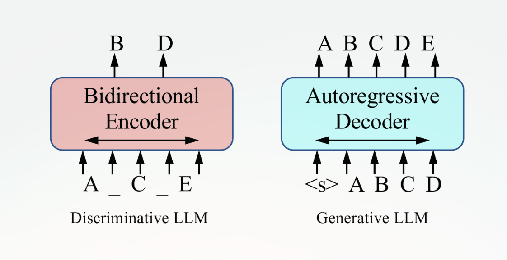
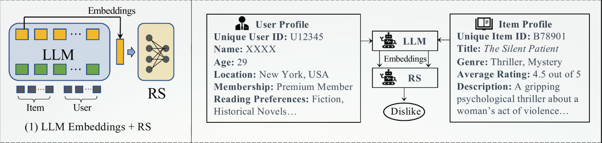
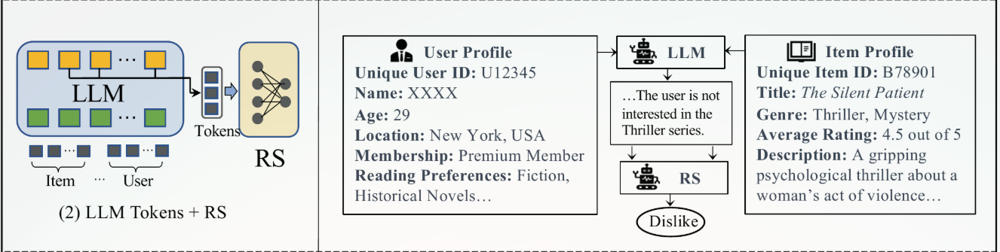
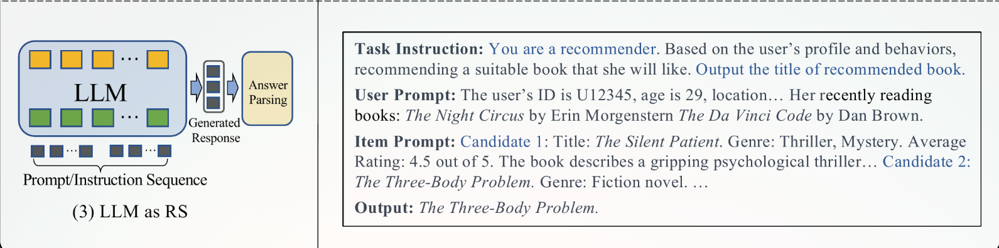
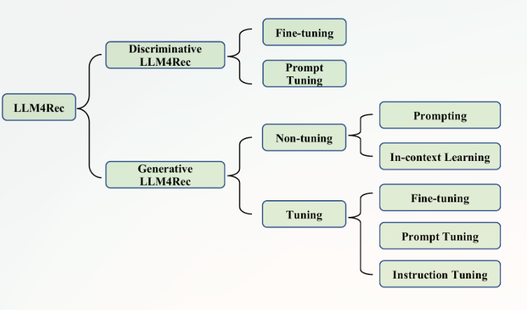
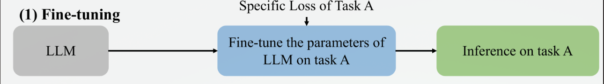
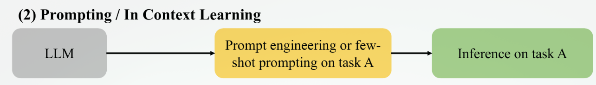
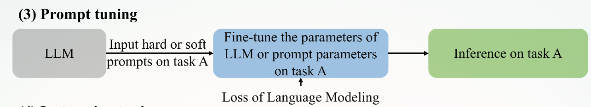
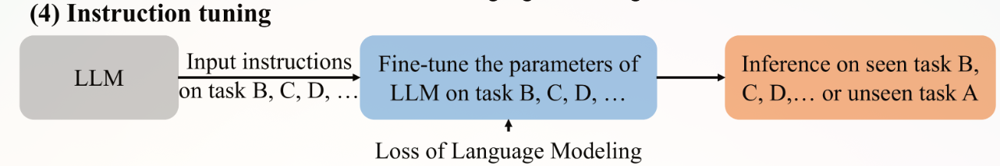
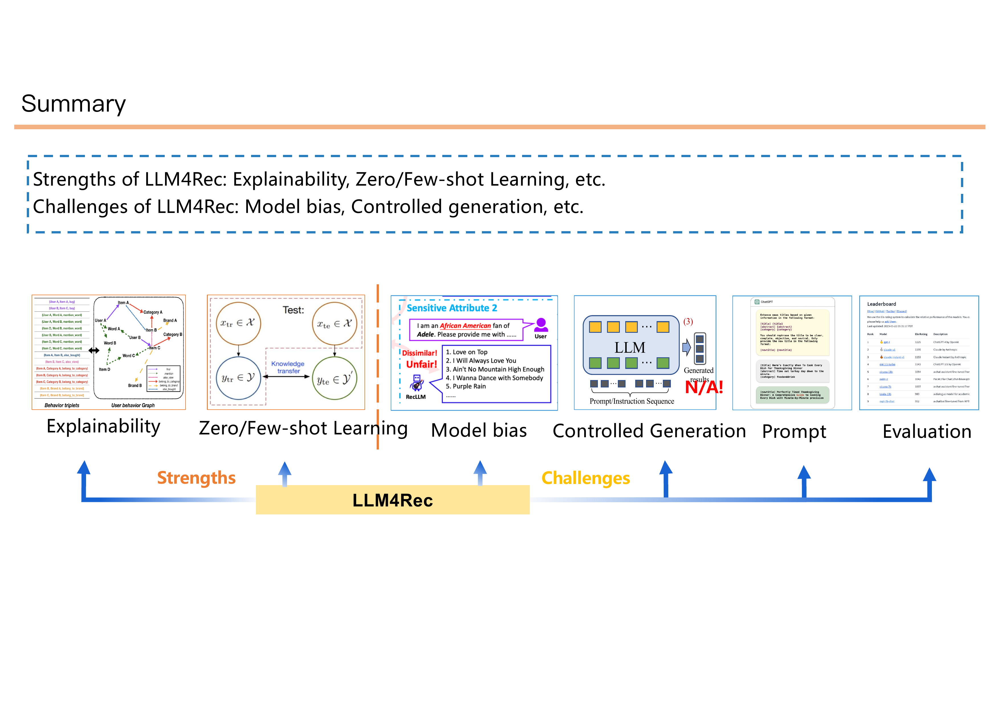

# Large Language Models for Recommendation (LLM4Rec)

---

## 1. Hai dòng chảy chính của LLMs (Discriminative vs Generative)

Trước khi ứng dụng vào Gợi ý, chúng ta cần hiểu bản chất của các Mô hình Ngôn ngữ Lớn (LLMs) được chia làm 2 nhánh chính dựa trên cấu trúc Transformer:

*Hình 1: Hai mô hình huấn luyện chính của LLMs: Discriminative LLM (VD: BERT) và Generative LLM (VD: GPT).*

- **Discriminative LLM (DLLM - Nhóm Phân biệt):** Dựa trên cấu trúc *Encoder-only* (như BERT, RoBERTa). Chúng chuyên về "Hiểu" (Understanding). Nhiệm vụ chính là Masked Language Modeling (Đoán từ bị che). Vector đầu ra của chúng mang ngữ nghĩa rất giàu có, lý tưởng để làm **Feature Extractor (Bộ trích xuất đặc trưng)** cho User hoặc Item.
- **Generative LLM (GLLM - Nhóm Tạo sinh):** Dựa trên cấu trúc *Decoder-only* (như GPT, LLaMA). Chúng chuyên về "Tạo sinh" (Generation) thông qua việc dự đoán từ tiếp theo (Next-token prediction). Nhóm này cực kỳ mạnh trong việc nói chuyện (Chatbot) và sinh ra kết quả gợi ý trực tiếp bằng văn bản.

---

## 2. Ba Mô hình Tích hợp vào Hệ thống Gợi ý

Làm sao để lắp một cái "Não" LLM vào một cái "Thân" RecSys? Có 3 cách lắp ráp (Paradigms) phổ biến nhất hiện nay:

**1. LLM Embeddings + RS (Dùng LLM làm Bộ nhúng):**

- LLM nhận đầu vào là thông tin của **item** và  **user** , rồi xuất ra các embeddings đại diện cho đặc trưng ngữ nghĩa của chúng
- Các Vector này sau đó được đẩy vào một mô hình Gợi ý truyền thống (RS) (như DCN, LightGCN). Ở đây, LLM chỉ đóng vai trò "tiền xử lý" dữ liệu.

**LLM Tokens + RS (Hội tụ Token):**

- Kết hợp chặt chẽ hơn. Dữ liệu văn bản (như review, title) và dữ liệu hành vi (click, mua) được ánh xạ về cùng một không gian Token. LLM và RS cùng nhau học và cập nhật trọng số trong quá trình huấn luyện.
- Ở cách này, LLM không chỉ trả về embedding như hình trước mà còn tạo ra tokens biểu diễn ngữ nghĩa từ thông tin user và item, rồi các token đó được đưa sang hệ gợi ý (RS) để ra quyết định.  Nói đơn giản, thay vì biến dữ liệu thành vector đặc trưng thuần số học, LLM “diễn giải” sở thích và nội dung thành chuỗi token mang ý nghĩa, giúp RS nắm được các tín hiệu ngữ nghĩa phong phú hơn.
- Trong ví dụ, user có hồ sơ cho thấy họ thích fiction nhưng không thích thriller series, còn item là một cuốn thriller có nội dung khá nặng về tâm lý.  LLM đọc hai hồ sơ này rồi sinh ra một mô tả ngắn kiểu: “The user is not interested in the Thriller series.” Sau đó RS dùng tín hiệu token đó để kết luận Dislike.
- Khác với LLM Embeddings + RS, nơi LLM chủ yếu tạo embedding số, cách này dùng token/chuỗi ngôn ngữ làm cầu nối giữa dữ liệu và hệ gợi ý.  Điểm mạnh là dễ khai thác ý nghĩa ngôn ngữ và có thể thể hiện sở thích theo cách gần với ngôn ngữ tự nhiên hơn; điểm yếu thường là phụ thuộc nhiều vào chất lượng token sinh ra và cách RS đọc chúng.

**LLM as RS (LLM tự làm Hệ thống Gợi ý):**

- Thay vì chỉ trích xuất đặc trưng hay sinh token trung gian, LLM nhận luôn một **prompt/instruction sequence** rồi trực tiếp sinh ra kết quả gợi ý.
- Ở ví dụ này, prompt gồm ba phần chính:  **Task Instruction** ,  **User Prompt** , và  **Item Prompt** . LLM đọc mô tả nhiệm vụ, hồ sơ người dùng, và các ứng viên item, rồi sinh ra một  **Generated Response** , sau đó bước **Answer Parsing** tách câu trả lời cuối cùng thành item được chọn.
- Cách này tận dụng mạnh khả năng hiểu ngôn ngữ, suy luận theo instruction, và sinh câu trả lời của LLM. Đổi lại, nó cũng dễ gặp vấn đề về kiểm soát định dạng đầu ra và độ ổn định khi phải xếp hạng nhiều item.

---

## 3. Bản đồ Phân loại (Taxonomy) của LLM4Rec

Dựa trên các nền tảng trên, bài Survey vẽ ra một bản đồ phân loại chi tiết các hướng nghiên cứu hiện tại:

*Hình 3: Bản đồ phân loại các nghiên cứu về LLM trong Hệ thống Gợi ý.*

| Nhánh                 | Làm gì                                                                                                                                                              | Mục tiêu                                                                                   |
| ---------------------- | --------------------------------------------------------------------------------------------------------------------------------------------------------------------- | -------------------------------------------------------------------------------------------- |
| Discriminative LLM4Rec | Dùng LLM kiểu BERT-like để mã hóa user/item thành embedding hoặc representation cho RS.                                                                       | Tăng chất lượng biểu diễn, cải thiện độ chính xác gợi ý, hỗ trợ cold-start.  |
| Fine-tuning            | Fine-tune LLM trên dữ liệu recommendation để học biểu diễn theo miền cụ thể.                                                                               | Làm embedding/representation sát bài toán hơn, nâng performance.                       |
| Prompt tuning          | Giữ gần như nguyên model, chỉ học prompt/soft prompt để thích nghi với task.                                                                                | Tiết kiệm tham số, giảm chi phí train mà vẫn thích nghi tốt.                        |
| Generative LLM4Rec     | Dùng LLM kiểu GPT-like để sinh trực tiếp kết quả recommendation bằng ngôn ngữ tự nhiên.                                                                  | Biến recommendation thành bài toán sinh, tăng khả năng giải thích và tương tác. |
| Prompting              | Viết prompt/instruction để LLM tự suy ra item nên recommend.                                                                                                     | Khai thác zero-shot/few-shot, triển khai nhanh, ít train.                                 |
| In-context Learning    | Đưa vài ví dụ user-item vào prompt để LLM học cách ra quyết định trong ngữ cảnh.                                                                       | Tăng độ chính xác mà không cần cập nhật tham số.                                  |
| Fine-tuning            | Huấn luyện lại generative LLM trên dữ liệu recommendation.                                                                                                      | Tăng hiệu năng trên task cụ thể, nhất là task sinh và xếp hạng.                   |
| Prompt tuning          | thêm một số soft prompt hoặc token học được vào đầu vào,soft prompt rồi chỉ tối ưu phần prompt đó để LLM hiểu bài toán recommendation. | Cân bằng giữa hiệu năng và chi phí huấn luyện.                                      |
| Instruction tuning     | Fine-tune LLM trên nhiều cặp instruction → response khác nhau, ví dụ: sequential recommendation, rating prediction, top-N recommendation.                | Làm model đa nhiệm, tăng khả năng hiểu và làm đúng nhiều task.                   |

*: Prompt bình thường là văn bản nhập vào, còn soft prompt là một đoạn embedding được train thêm vào trước input.

---

## 4. Các Phương pháp Huấn luyện LLM cho RecSys (Domain Adaptation)

Do LLM ban đầu được học trên dữ liệu chữ chung chung (Wikipedia, Sách), muốn nó giỏi việc Gợi ý bán hàng (Domain-specific), ta phải "Dạy thêm" (Adaptation).

### Fine-tuning

Fine-tuning nghĩa là lấy một LLM đã pretrain sẵn rồi **huấn luyện tiếp toàn bộ hoặc phần lớn tham số** của nó trên một task cụ thể, với **specific loss của task đó**. Trong hình, phần “Specific Loss of Task A” đi vào khối fine-tune để mô hình học đúng task A, sau đó mới đem đi inference trên chính task A.

Trong LLM4Rec, fine-tuning thường được dùng khi bạn có dữ liệu recommendation đủ rõ, ví dụ user-item interaction, profile text, item description, sequence behavior. Mục tiêu là làm cho embedding hoặc đầu ra của LLM phù hợp hơn với bài toán gợi ý cụ thể, như ranking, rating prediction, sequential recommendation, hay text-based recommendation.

Điểm mạnh của fine-tuning là hiệu năng thường cao hơn prompt-only, vì mô hình học trực tiếp từ dữ liệu miền. Nhưng đổi lại, nó tốn tài nguyên hơn, dễ overfit nếu dữ liệu ít, và khó giữ nguyên tri thức chung của LLM nếu chỉnh quá mạnh.

Nhiều mô hình như GPTRec, TALLRec, UniCRS hoặc các biến thể text-based sequential recommendation đều nằm trong tinh thần này: đưa recommendation data vào để LLM học sâu hơn thay vì chỉ dùng prompt.

### Prompting / In-context Learning

Prompting và in-context learning là cách **không cập nhật tham số mô hình**, mà chỉ thay đổi cách đặt câu hỏi hoặc đưa vài ví dụ mẫu vào prompt để LLM suy luận. Trong hình, LLM được đưa thẳng vào “Prompt engineering or few-shot prompting on task A”, rồi inference ngay trên task A.

Trong paper, đây là hướng rất quan trọng cho generative LLM4Rec vì nó khai thác khả năng zero-shot/few-shot sẵn có của LLM. Tức là bạn có thể thử recommendation ngay cả khi chưa train lại model, chỉ cần mô tả task rõ ràng, thêm user history, item candidates, hoặc một vài demo mẫu nếu cần.

Mục tiêu của hướng này là nhanh, rẻ, dễ thử nghiệm. Tuy nhiên, hiệu năng thường phụ thuộc rất mạnh vào chất lượng prompt, cách diễn đạt instruction. Có nhiều vấn đề như position bias, output format không ổn định, và giới hạn context length.

### Prompt tuning

Prompt tuning nằm giữa hai cực: nó không chỉnh toàn bộ model như fine-tuning, cũng không chỉ viết prompt bằng tay như prompting. Thay vào đó, nó là việc đưa vào **hard prompt hoặc soft prompt**, rồi **huấn luyện prompt parameters** hoặc một phần rất nhỏ của mô hình để LLM thích nghi với task A.

Cốt lõi của prompt tuning là giữ phần lớn LLM gần như đóng băng, còn phần prompt được học sẽ đóng vai trò “mã hướng dẫn” để mô hình phản hồi đúng kiểu recommendation mong muốn. Trọng tâm là **tối ưu prompt** thay vì tối ưu toàn bộ model.

Mục tiêu của prompt tuning is tiết kiệm tham số, giảm chi phí train, và vẫn có thể đạt hiệu năng tốt hơn prompt thủ công.

### Instruction tuning

Thay vì chỉ học một task đơn lẻ, mô hình được fine-tune trên **nhiều instruction khác nhau**: sequential recommendation, rating prediction, explanation generation, top-N recommendation, retrieval, v.v.

Trong hình, LLM được cho “Input instructions on task B, C, D, ...”, sau đó học trên nhiều task cùng lúc, và khi inference thì có thể chạy trên task đã thấy hoặc thậm chí một task chưa thấy.  giúp tăng **generalization** và **zero-shot ability**.

Mục tiêu của instruction tuning không chỉ là làm mô hình giỏi một bài recommendation, mà là làm nó **hiểu cách làm theo chỉ thị** trong nhiều bối cảnh recommendation khác nhau. Điều này rất phù hợp với các hệ LLM-based recommender cần vừa trả lời gợi ý, vừa giải thích, vừa chat, vừa xử lý nhiều dạng đầu vào từ user.

---

## 5. Điểm Mạnh (Strengths) và Thử Thách (Challenges) của LLM4Rec

*Hình 7: Các điểm mạnh cốt lõi và những thử thách kỹ thuật đang chờ đợi lĩnh vực LLM4Rec.*

### Bốn Điểm Mạnh Cốt Lõi (Strengths)

1. **Zero/Few-shot Recommendation:** Gợi ý tốt kể cả khi có rất ít hoặc không có dữ liệu lịch sử.
2. **Khả năng Tự Giải thích (Self-Explainability):** Biết nói lý do vì sao chọn sản phẩm đó.
3. **Conversational Recommendation:** Dễ dàng chat và tương tác với người dùng để xin thêm thông tin.
4. **Hiểu được Ngữ nghĩa chéo (Cross-domain Understanding):** Mang kiến thức từ mảng phim ảnh sang mảng âm nhạc dễ dàng vì tất cả đều là Text.

### Bốn Thử Thách Chí Mạng (Challenges)

1. **Thiếu Hụt Kiến thức (Knowledge Gap / Hallucination):** LLM hay nói dối hoặc không cập nhật sản phẩm mới.
2. **Thiên Kiến (Bias):** LLM thích gợi ý các sản phẩm "Quốc dân" (Popularity Bias) thay vì đồ ngách (Niche items).
3. **Rào cản Định dạng (Formatting Gap):** ID người dùng là các con số vô nghĩa, LLM rất khó hiểu các con số này.
4. **Khó Đánh giá (Evaluation Criteria):** Các chỉ số đánh giá cũ (NDCG, Recall) không còn phù hợp để đánh giá một đoạn văn tư vấn của LLM.
