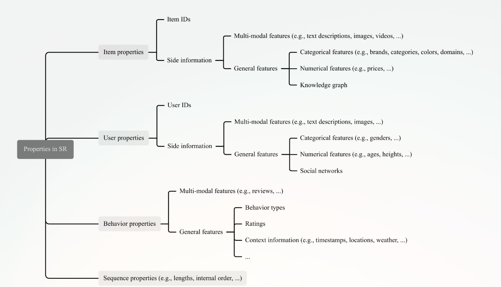
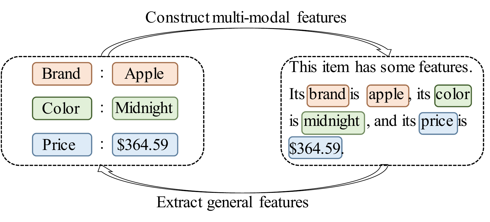
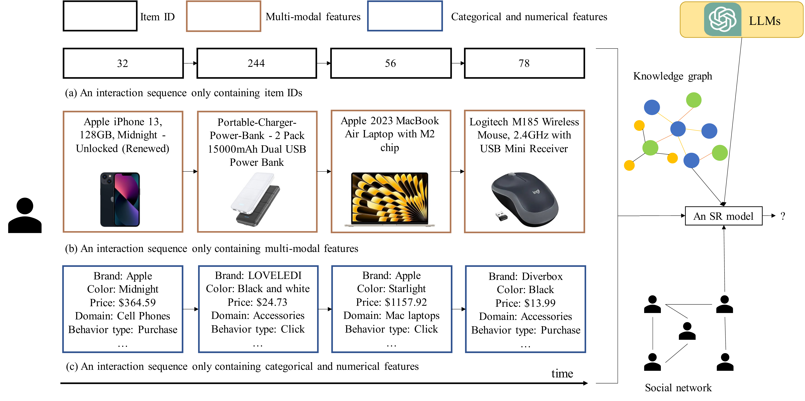

# Sequential Recommendation (Fundamental)

**Nguồn:** "A Survey on Sequential Recommendation" (Pan et al., Tháng 12/2024, arXiv:2412.12770).

---

## 1. Hệ Sinh Thái Thuộc Tính (Properties) Trong Gợi Ý Tuần Tự

Để dự đoán chính xác "bước đi tiếp theo" của người dùng, hệ thống SR không chỉ nhìn vào các con số vô tri (ID) mà phải xây dựng một hệ sinh thái các thuộc tính.

*Hình 1: Các thuộc tính (Properties) cốt lõi trong Gợi ý Tuần tự.*

Theo mô tả trong mã nguồn, hệ sinh thái này gồm 4 trụ cột:

1. **Item Properties (Thuộc tính Sản phẩm):** Không chỉ có Item ID, mỗi sản phẩm còn mang theo "Side Information" (Thông tin phụ trợ). Thông tin này được chia làm hai loại:
   - *General Features (Đặc trưng chung):* Categoria (Danh mục), Numerical (Giá cả, Điểm đánh giá), hoặc Knowledge Graph (Đồ thị tri thức).
   - *Multi-modal Features (Đặc trưng đa phương thức):* Text (Văn bản mô tả), Image (Hình ảnh sản phẩm), Video. Đây là chìa khóa để chuyển giao tri thức (Transfer learning) giữa các nền tảng khác nhau vì ngôn ngữ và hình ảnh là phổ quát.
2. **User Properties (Thuộc tính Người dùng):** Gồm User ID và các thông tin cá nhân (Side info). Tuy nhiên, vì lý do bảo mật quyền riêng tư (Privacy), thông tin này thường bị ẩn hoặc hạn chế sử dụng.
3. **Behavior Properties (Thuộc tính Hành vi):** Bao gồm loại hành vi (Click, Mua, Thêm vào giỏ hàng) và *Context* (Ngữ cảnh như Thời gian - Timestamp, và Không gian - Location).
4. **Sequential Properties (Thuộc tính Chuỗi):** Chiều dài của chuỗi (Length) và Trật tự nội tại (Internal order) của các item trong chuỗi đó.

---

## 2. Sự Giao Thoa Giữa Các Loại Đặc Trưng (Feature Conversions)

Một điểm sáng tạo trong các mô hình SR hiện đại là khả năng "hô biến" các loại dữ liệu qua lại lẫn nhau để tận dụng sức mạnh của các mô hình như LLMs.

*Hình 2: Quá trình chuyển đổi qua lại giữa Đặc trưng đa phương thức (Multi-modal) và Đặc trưng chung (General).*

- **Biến Số thành Chữ (General $\rightarrow$ Multi-modal):** Chúng ta có thể lấy các thuộc tính rời rạc như "Thương hiệu" (Brand), "Giá" (Price), "Màu sắc" (Color) và ghép chúng thành một câu văn bản hoàn chỉnh. Lúc này, các LLMs có thể đọc và trích xuất một "Universal Representation" (Biểu diễn phổ quát) cho sản phẩm đó.
- **Biến Chữ thành Số (Multi-modal $\rightarrow$ General):** Ngược lại, từ một đoạn văn bản mô tả (Review/Description), chúng ta có thể dùng công nghệ khai phá dữ liệu để bóc tách ra các thuộc tính nhãn (ví dụ: bóc tách ra brand, color, price).
- *Lưu ý (Từ nhóm tác giả):* Quá trình chuyển đổi này có rủi ro. Biến Timestamp thành văn bản có thể làm mất đi độ chính xác tinh vi của thời gian. Còn việc bóc tách thuộc tính từ văn bản có thể lẫn tạp âm (noise).

---

## 3. Bốn Cấp Độ Của Hệ Thống Gợi Ý Tuần Tự

Phân loại SR dựa trên **Thuộc tính của Item (Item Properties)** được nạp vào mô hình.

*Hình 3: Minh họa 4 cấp độ/thể loại của Hệ thống Gợi ý tuần tự dựa trên đầu vào.*

Có 4 cấp độ:

1. **(a) Pure ID-based SR (Chỉ dùng ID):** Các mô hình đời đầu (như SASRec, GRU4Rec) chỉ dùng Item ID. Chúng hoạt động nhanh, nhưng dễ dàng "mù lòa" khi gặp dữ liệu thưa thớt (Data Sparsity) hoặc sản phẩm mới (Cold-start).
2. **(c) SR with General Features (ID + Đặc trưng chung):** Để chống lại Cold-start, các mô hình này tiêm thêm các thông số như Giá cả, Danh mục, hoặc cả Mạng xã hội của người dùng vào chuỗi.
3. **(b) Pure Multi-modal SR (Chỉ dùng Đa phương thức):** Đỉnh cao của sự linh hoạt (Transferability). Bỏ hẳn Item ID. Chỉ dùng Text/Image/Video để đại diện cho Item. Nhờ vậy, một mô hình huấn luyện trên Amazon có thể đem sang dùng cho Shopee dễ dàng vì nó chỉ đọc chữ và xem ảnh, không quan tâm đến ID nội bộ của hệ thống.
4. **(a) + (b) Hybrid SR (ID + Multi-modal):** Sự kết hợp hoàn hảo. Vì chỉ dùng Multi-modal đôi khi làm mất đi các sở thích chi tiết (fine-grained interests) ẩn sau ID. Sự kết hợp này mang lại sức mạnh cao nhất (đây là sân chơi chính của các LLM-based RecSys hiện tại).
