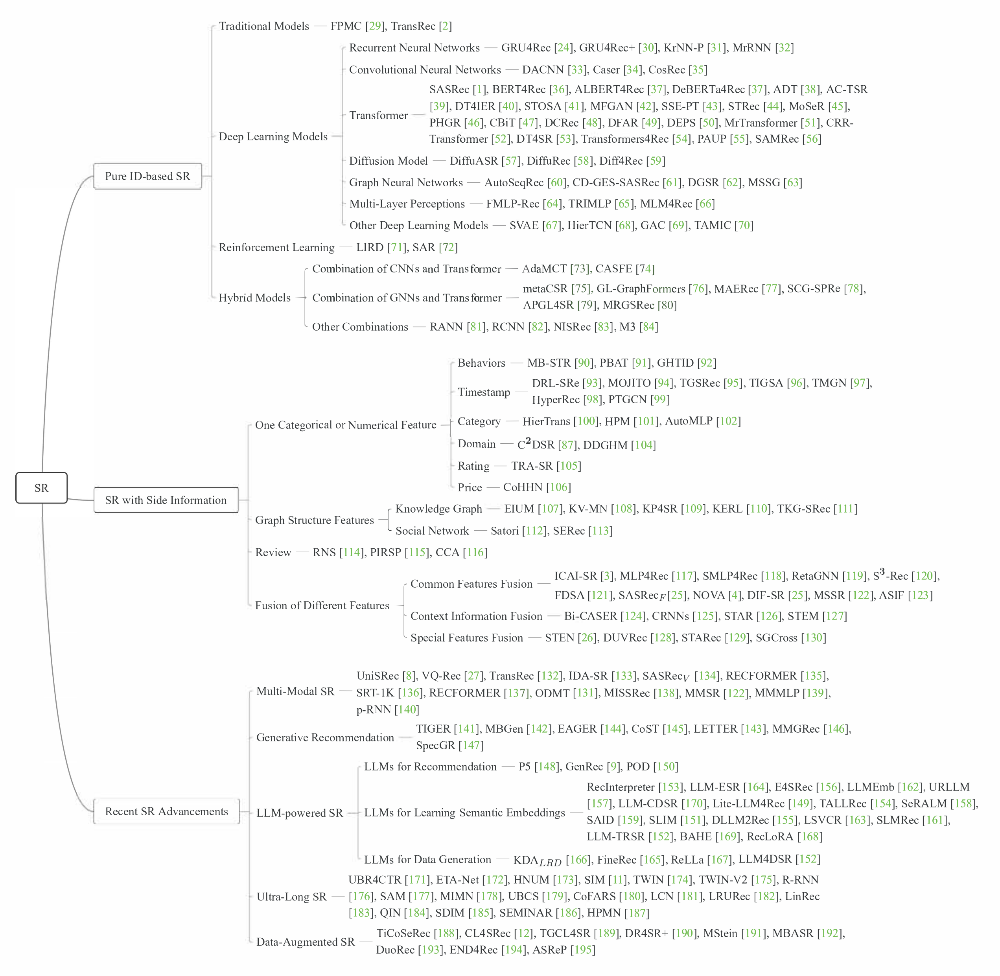
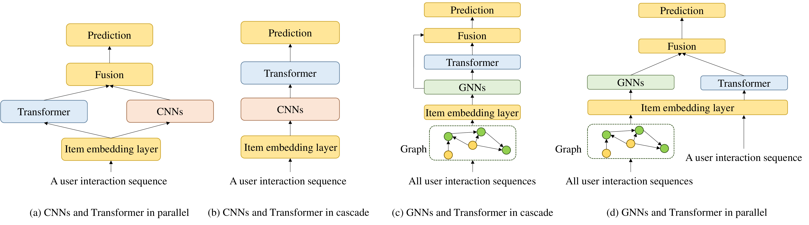
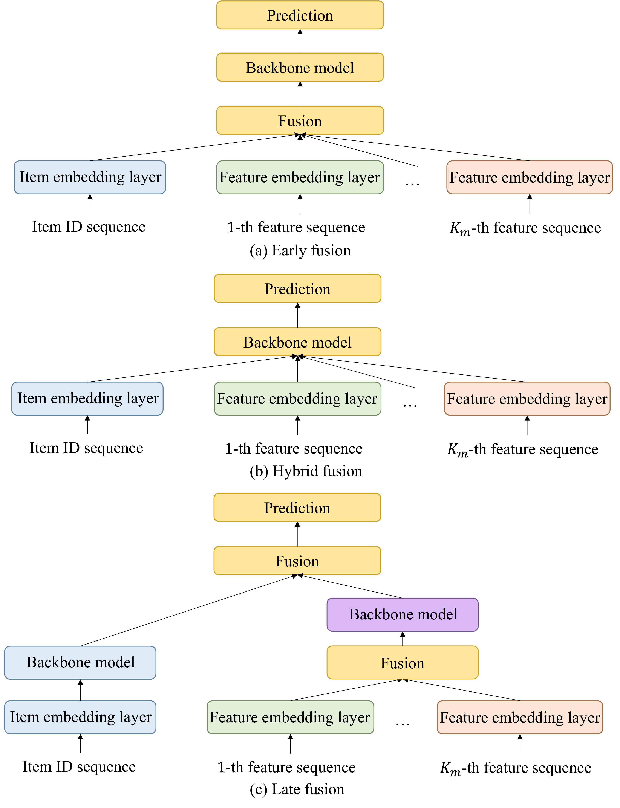

# A Survey on Sequential Recommendation (Phần 2)

"A Survey on Sequential Recommendation" (Pan et al., Tháng 12/2024, arXiv:2412.12770).

Tiếp nối Phần 1 về dữ liệu, Phần 2 này sẽ đi sâu vào **Bản đồ Phân loại Kiến trúc (Taxonomy)** khổng lồ của Gợi ý Tuần tự (Sequential Recommendation) và các **Chiến lược Kết hợp (Combination Strategies)** để tận dụng tối đa sức mạnh của nhiều loại mạng Neural khác nhau.

---

## 4. Bản Đồ Phân Loại Gợi Ý Tuần Tự (Taxonomy of SR)

Các nhà nghiên cứu đã tổng hợp hàng trăm bài báo để vẽ ra một bức tranh toàn cảnh về cách các mô hình SR tiến hóa. Bức tranh này chia làm 3 nhánh lớn (dựa trên Dữ liệu đầu vào):

*Hình 4: Bản đồ phân loại toàn diện các nghiên cứu về Gợi ý Tuần tự. (Trích từ Hình 5 trong bài báo gốc)*

Theo Section 4, 5 và 6 của bài báo, ba nhánh này bao gồm:

### Nhánh 1: Pure ID-based SR (Chỉ dựa trên Item ID)

Đây là nguồn cội của Gợi ý tuần tự. Hệ thống chỉ học sự chuyển tiếp từ Item 1 sang Item 2.

- **Traditional Models:** FPM (Tìm luật kết hợp), Markov Models (Dự đoán dựa trên bước ngay trước đó), Latent Factor Models.
- **Deep Learning Models:**
  - *RNNs (GRU4Rec):* Từng là vua, giải quyết bài toán phụ thuộc dài hạn.
  - *CNNs (Caser):* Xem chuỗi click như một "bức ảnh" 1D và dùng bộ lọc tích chập (Convolution filters) để quét tìm các thói quen (patterns) cục bộ.
  - *Transformer (SASRec, BERT4Rec):* Cú hích lớn nhất nhờ cơ chế Self-Attention, cho phép mô hình "nhìn" toàn bộ chuỗi cùng lúc.
  - *GNNs (SR-GNN):* Đỉnh cao của tư duy phi tuyến tính. Biến chuỗi click thành một đồ thị để tìm các cú "click vòng vèo" (nhảy cóc).
  - *Diffusion Models (DiffuRec):* Làn sóng mới, dự đoán bằng cách thêm nhiễu/khử nhiễu để giải quyết dữ liệu siêu thưa thớt.
  - *MLPs:* Bất ngờ trở lại vì tính toán $O(N)$ siêu nhanh (khắc phục nhược điểm $O(N^2)$ của Transformer).

### Nhánh 2: SR with Side Information (Cộng gộp Dữ liệu phụ trợ)

Nhánh này khắc phục chứng "Mù lòa" khi gặp Item mới của nhánh 1.

- *One Categorical/Numerical Feature:* Thêm Giá cả, Danh mục, Nhãn thời gian (Timestamp).
- *Review:* Dùng Text review để hiểu *tại sao* người dùng lại thích.
- *Graph Structure:* Nhúng thêm Đồ thị tri thức (Knowledge Graph) hoặc Mạng xã hội (Social Network).

### Nhánh 3: Recent Advancements (Những tiến bộ mới nhất - Đặc trưng Đa phương thức & LLMs)

Nhánh này loại bỏ hoàn toàn (hoặc một phần) sự phụ thuộc vào Item ID.

- *Pure Multi-modal:* Dùng mô hình ngôn ngữ (như BERT) đọc chữ, dùng mô hình ảnh (như ResNet) xem ảnh để lấy ra vector biểu diễn của sản phẩm.
- *LLMs-powered SR:* Đưa nguyên lịch sử cho LLaMA/ChatGPT đọc và chốt đơn bằng ngôn ngữ tự nhiên.
- *Generative SR:* Biến ID thành dạng chữ (Semantic ID) để LLM có thể phát sinh chuỗi.

---

## 5. Chiến Lược Kết Hợp Các Kiến Trúc (Combination Strategies)

Mỗi mạng Neural có một "điểm mù" riêng. (Ví dụ: CNN nhìn rất ngắn, Transformer ngốn quá nhiều RAM, GNN tính toán đồ thị quá chậm). Do đó, xu hướng tất yếu là **KẾT HỢP (Hybrid Models)**.

*Hình 5: Bốn chiến lược kết hợp phổ biến để tạo ra các Mô hình Lai (Hybrid Models) cực mạnh. (Trích từ Hình 6 trong bài báo gốc)*

Theo Section 4.4, có 4 công thức kết hợp kinh điển:

1. **(a) CNNs + Transformer (Chạy Song song - Parallel):**

   - CNN có nhiệm vụ tìm các thói quen ngắn hạn (short-term dependencies).
   - Transformer có nhiệm vụ nhìn bao quát toàn bộ lịch sử (long-term dependencies).
   - *Kết quả:* Hai luồng chạy song song và cộng gộp (Fuse) ở cuối.
2. **(b) CNNs $\rightarrow$ Transformer (Nối tiếp - Cascade):**

   - Dùng CNN chạy trước để đóng gói các click gần nhau thành một "Cụm hành vi" (Local chunk).
   - Đẩy các Cụm hành vi này vào Transformer. Cách này giúp Transformer đọc ít dữ liệu hơn, tăng tốc độ đáng kể.
3. **(d) GNNs + Transformer (Chạy Song song - Parallel):**

   - GNNs được dùng để quét trên toàn bộ Đồ thị toàn cục (Global Graph) để tìm xem *những người dùng khác* đang thích gì (Collaborative Filtering).
   - Transformer quét chuỗi cá nhân của chính người dùng đó.
   - *Kết quả:* Sự kết hợp giữa Sở thích cá nhân và Xu hướng cộng đồng.
4. **(c) GNNs $\rightarrow$ Transformer (Nối tiếp - Cascade):**

   - GNNs học thuộc cấu trúc đồ thị trước để lấy ra các Biểu diễn đồ thị (Graph Embeddings) của từng Item.
   - Nhét các Graph Embeddings này vào Transformer để học thứ tự thời gian. Đây là cách làm chuẩn mực nhất hiện nay cho các hệ thống Graph-Sequential.

---

## 6. Chiến Lược Kết Hợp Nhiều Đặc Trưng (Multi-Features Fusion)

Khi bạn có quá nhiều dữ liệu (Item ID, Giá cả, Màu sắc, Danh mục), nhét chúng vào mô hình như thế nào để không bị "loạn tẩu hỏa nhập ma"?

*Hình 6: Các chiến lược dung hợp (fusion) khi xử lý nhiều luồng dữ liệu phụ trợ.*

1. **(a) Đầu vào hỗn hợp (Early Fusion / Addition):**
   - Cộng dồn tất cả các Vector lại với nhau (Ví dụ: $Vector_{ID} + Vector_{Price} + Vector_{Color}$) rồi mới đẩy vào Transformer.
   - *Điểm yếu:* Bị gọi là cách làm "Xâm lấn" (Invasive), làm nhiễu thông tin gốc của Item ID.
2. **(b) Attention lai (Decoupled/Integrated Fusion):**
   - Không cộng dồn từ đầu. Thay vào đó, trong lúc cơ chế Self-Attention của Transformer hoạt động (tính toán hàm Query, Key, Value), ta cho các Vector phụ trợ can thiệp vào để làm thay đổi Trọng số (Attention weights). Cách này tinh tế hơn (Ví dụ điển hình là mô hình DIF-SR, NOVA).
3. **(c) Chạy luồng riêng (Late Fusion):**
   - Dùng một mạng nhỏ gộp tất cả thông tin phụ (Features) lại.
   - Dùng một mạng lớn xử lý Item ID riêng.
   - Phút cuối mới "chốt hạ" gộp 2 luồng lại để ra kết quả cuối cùng. Cách này giữ được sự trong sáng tuyệt đối cho Item ID.
