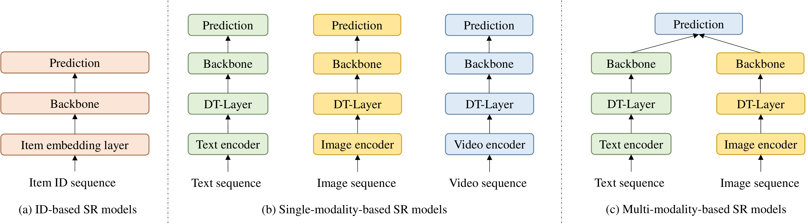
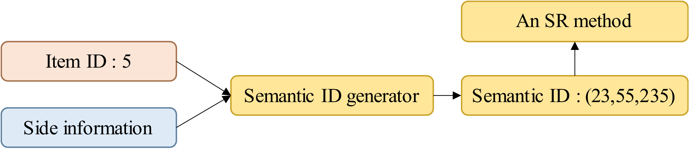
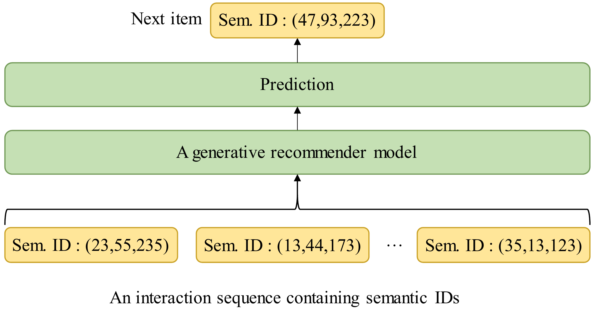
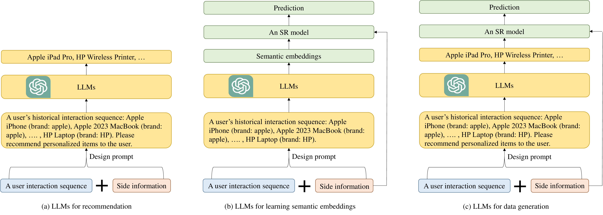
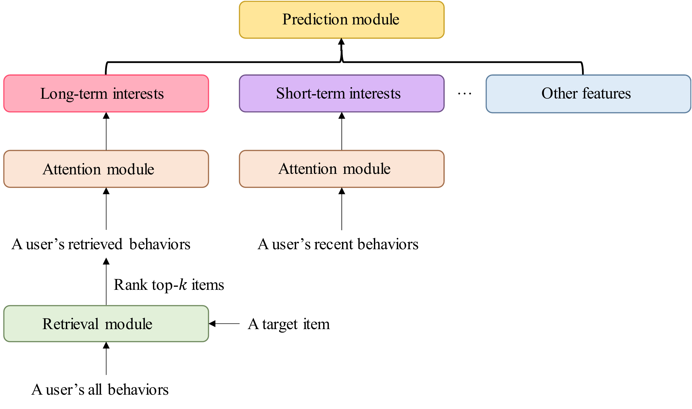

# A Survey on Sequential Recommendation (Recent Advancements)

"A Survey on Sequential Recommendation" (Pan et al., Tháng 12/2024, arXiv:2412.12770).

---

## 7. Multi-Modal SR (Gợi Ý Đa Phương Thức)

Nhằm loại bỏ sự phụ thuộc vào Item ID vô nghĩa.

*Hình 7: Sự khác biệt giữa SR truyền thống (ID-based) và SR dùng đặc trưng Đa phương thức (Modal-based). (Trích từ Hình 9)*

**Ý tưởng cốt lõi:**

- Thay vì biểu diễn iPhone bằng ID "1234", ta dùng một Mô hình ngôn ngữ (như BERT) để đọc dòng chữ "Điện thoại iPhone 15 Pro Max" và tạo ra một Text Vector.
- Dùng một Mô hình ảnh (như Swin Transformer) để quét bức ảnh cái điện thoại và tạo ra một Image Vector.
- Gộp chúng lại thành Biểu diễn của Item.

**Tại sao nó tạo ra đột phá?**

1. **Transfer Learning (Chuyển giao tri thức):** Một mô hình huấn luyện ở Amazon có thể dùng ngay cho Tiktok Shop, vì cả hai đều dùng chung "ngôn ngữ con người" và "hình ảnh" (ID-agnostic).
2. **Cold-start:** Item mới ra lò chưa ai click vẫn có thể được gợi ý ngay vì hệ thống đã "đọc" và "nhìn" được nó.

---

## 8. Generative Recommendation & Semantic IDs (Gợi Ý Tạo Sinh)

Năm 2023-2024 chứng kiến sự ra đời của **Generative Retrieval** (Nổi bật nhất là mô hình TIGER).

  
  

*Hình 8: Quá trình tạo Semantic ID (Trái) và Cách Generative Rec nhả kết quả (Phải). (Trích Hình 10 & 11)*

**Khái niệm Semantic ID (ID Ngữ Nghĩa):**

- Thay vì cấp một ID ngẫu nhiên, ta nhóm các sản phẩm có cùng đặc điểm vào một "Thư mục".
- Ví dụ: Thư mục Thể thao (ID: 10) $\rightarrow$ Giày (ID: 05) $\rightarrow$ Nike (ID: 22). ID của đôi giày sẽ là một chuỗi token: `<10, 05, 22>`. Kỹ thuật thường dùng là RQ-VAE (Residual Quantization VAE).

**Cách hoạt động (Hình bên Phải):**

- Lịch sử người dùng: `[Giày Adidas], [Áo thể thao Puma]`.
- Mô hình Tạo sinh (như T5, LLaMA) nhận chuỗi này và bắt đầu **dự đoán Token tiếp theo (Autoregressive)**.
- Nó không dự đoán ra 1 cái áo cụ thể ngay lập tức, mà dự đoán: "Chắc chắn ông này mua đồ Thể thao (<10>), tiếp theo là Áo (<06>), hiệu Nike (<22>)". Kết quả nó sinh ra chuỗi `<10, 06, 22>`.

---

## 9. LLMs trong Gợi Ý Tuần Tự (LLM-powered SR)

Khi LLM (ChatGPT, LLaMA, Qwen, DeepSeek) xuất hiện, chúng thay đổi hoàn toàn luật chơi.

*Hình 9: Ba cách sử dụng LLM trong Hệ thống Gợi ý. (Trích từ Hình 12)*

Theo Section 6.3, các nhà nghiên cứu chia làm 3 trường phái sử dụng LLM:

1. **(a) Trực tiếp Gợi ý (Direct Recommendation):** Đưa toàn bộ lịch sử click vào Prompt. LLM đóng vai trò như một chuyên gia tư vấn và nhả trực tiếp ra kết quả (Ví dụ: Mô hình P5, TALLRec).
2. **(b) Trích xuất Ngữ nghĩa (Learning Semantic Embeddings):** LLM đóng vai trò là "người đọc hiểu". Nó nhận Text mô tả sản phẩm và tạo ra những Vector ngữ nghĩa (Embeddings) sâu sắc và thông minh hơn nhiều so với BERT truyền thống, sau đó nhét Vector này vào mô hình SR cũ.
3. **(c) Tạo sinh Dữ liệu (Data Generation):** Dùng LLM để "đẻ" thêm dữ liệu ảo (Augmentation) khi dữ liệu thực tế quá thưa thớt, hoặc dùng LLM để trích xuất các mối quan hệ ẩn (Ví dụ: "Tại sao người dùng mua Bỉm lại hay mua Bia?").

---

## 10. Ultra-Long SR (Gợi Ý Chuỗi Siêu Dài)

Một người dùng Tiktok có thể vuốt qua 2000 video trong một tuần. Chuỗi siêu dài (Ultra-long sequence, $N > 1000$) là một thảm họa với Transformer vì ma trận Attention sẽ phình to ra $N^2$ (Hết RAM ngay lập tức).

*Hình 10: Cơ chế kinh điển để xử lý Chuỗi thời gian Siêu Dài. (Trích từ Hình 13)*

**Giải pháp kinh điển (Section 6.4):** Không thể cho mô hình đọc toàn bộ từ đầu đến cuối. Phải cắt ra thành 2 luồng:

- **Luồng Ngắn hạn (Short-term Interests):** Lấy 50 items gần đây nhất (Recent Sequence). Đẩy qua Attention để lấy ý định mua sắm ngay lập tức.
- **Luồng Dài hạn (Long-term Interests):** Dùng một cơ sở dữ liệu để tìm kiếm (Retriever) các items trong quá khứ *có liên quan nhất* đến candidate item (Ví dụ đang định mua điện thoại thì chỉ lục lại lịch sử mua đồ công nghệ năm ngoái, bỏ qua lịch sử mua quần áo). (Mô hình SIM là người đi tiên phong cho trò này).
- Cuối cùng, gộp chung hai sở thích ngắn hạn và dài hạn để dự đoán.

*(Lưu ý ngoài lề: Hiện tại năm 2025-2026, kiến trúc **Mamba (State Space Models)** đang trỗi dậy mạnh mẽ để giải quyết bài toán Ultra-Long này nhờ độ phức tạp $O(N)$ mà không cần phải dùng Retriever phức tạp như Hình 10).*
