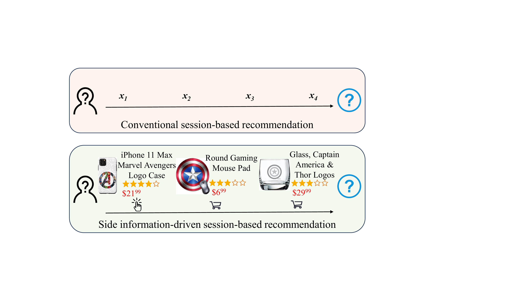
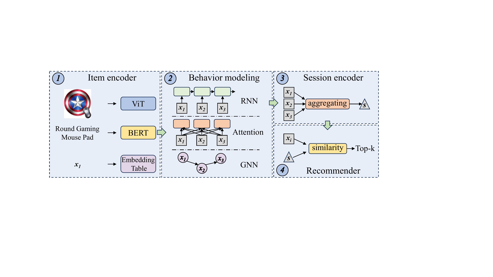
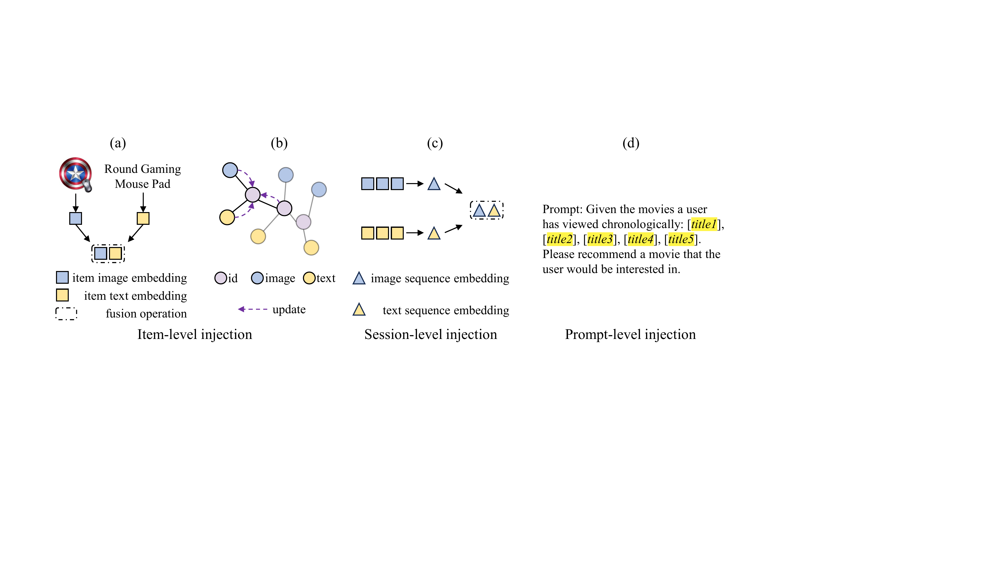

# A Survey on Side Information-driven Session-based Recommendation

**Nguồn:** Trích xuất từ mã nguồn LaTeX của bài báo "A Survey on Side Information-driven Session-based Recommendation: From a Data-centric Perspective" (Zhang et al., May 2025, arXiv:2505.12279).

Khác với Sequential Recommendation (Biết rõ User là ai, chuỗi kéo dài hàng tháng), **Session-based Recommendation (SBR)** là bài toán khắc nghiệt hơn: User hoàn toàn ẩn danh, và chuỗi click chỉ tồn tại ngắn ngủi trong một phiên lướt web (Ví dụ: Người lạ dùng tab ẩn danh vào Shopee click 3 cái).

Vì chuỗi quá ngắn (Data Scarcity), giải pháp duy nhất là phải dùng **Dữ liệu phụ trợ (Side Information)**.

---

## 1. Sự Khác Biệt: Conventional SBR vs Side Information-Driven SBR

Tại sao lại phải nhồi nhét thêm dữ liệu? Bức ảnh đầu tiên của bài báo giải thích điều này cực kỳ trực quan.

*Hình 1: So sánh giữa SBR Truyền thống (Chỉ dùng Item ID) và SBR có Dữ liệu phụ trợ. (Trích Hình 1 từ bài báo gốc)*

- **Hàng trên (Conventional SBR):** Hệ thống chỉ nhìn thấy người dùng click vào: `Item 4 -> Item 8 -> Item 2`. Nó giống như nhìn vào một bức tường toàn những con số vô nghĩa. Hệ thống chỉ có thể đoán "Những người click Item 2 thường sẽ click Item 9", nhưng không hiểu lý do tại sao.
- **Hàng dưới (Side Information-driven SBR):** Khi đưa thêm thông tin phụ, bức tranh sáng tỏ. `Item 4` là cái Áo khoác da, `Item 8` là cái Quần jeans đen. À, ra là người dùng đang định phối đồ theo phong cách "Biker/Da đen". Nhờ có thêm dữ liệu (Category, Hình ảnh), hệ thống đoán trúng phóc người dùng muốn mua cái Túi xách da (`Item 9`).

Đó là sức mạnh của Dữ liệu phụ trợ: Nó soi sáng **Ý định (Intent)** thực sự của người dùng.

---

## 2. Quy Trình 4 Bước của SBR Đa Dữ Liệu (The Workflow)

Khi có thêm thông tin phụ trợ, quy trình học của mô hình mạng nơ-ron thay đổi ra sao?

*Hình 2: Quy trình 4 bước của SBR dựa trên dữ liệu phụ trợ. (Trích Hình 2 từ bài báo gốc)*

Theo nhóm tác giả, quy trình này gồm 4 khối kiến trúc chính:

1. **Item Encoder (Bộ mã hóa Sản phẩm):** Thay vì chỉ dùng bảng tra cứu (Look-up table) để biến ID thành Vector, giờ đây bộ mã hóa phải ăn thêm Hình ảnh (qua CNN/ViT) và Văn bản mô tả (qua BERT/LLM).
2. **Behavior Modeling (Mô hình hóa Hành vi):** Xử lý luồng chuỗi. Ở bước này, các kỹ sư thường dùng RNN (GRU4Rec), Attention/Transformer (SASRec), hoặc Graph Neural Networks (SR-GNN) để xem các Item tác động qua lại với nhau như thế nào trong một phiên ngắn.
3. **Session Encoder (Bộ mã hóa Phiên):** Nén toàn bộ chuỗi click vừa rồi lại thành 1 Vector duy nhất. Vector này đại diện cho "Suy nghĩ/Nhu cầu" hiện tại của ông khách ẩn danh.
4. **Recommender (Bộ Gợi ý):** Lấy Vector Phiên (ở bước 3) đem đi đo khoảng cách Cosine với toàn bộ các Sản phẩm trong kho (Item Embeddings) để nhả ra kết quả Top-K.

---

## 3. Ba Chiến Lược Bơm Dữ Liệu (Data Injection Strategies)

Phần hay nhất của bài khảo sát nằm ở câu hỏi kỹ thuật: "Ta có dữ liệu ảnh, giá, text, nhưng ta 'bơm' nó vào mô hình ở vị trí nào để không bị nghẽn cổ chai?"

*Hình 3: Ba phương thức Bơm (Inject) dữ liệu phụ trợ: Cấp độ Sản phẩm, Cấp độ Phiên, và Cấp độ Prompt. (Trích Hình 3 từ bài báo gốc)*

Theo bài báo, có 3 cách để ép hệ thống nuốt khối lượng dữ liệu khổng lồ này:

### (a) Item-level Injection (Bơm ở Cấp độ Sản phẩm)

- **Cách làm:** Gắn thông tin phụ (VD: Hình ảnh, Giá tiền) vào *từng sản phẩm một* ngay từ đầu. `Vector Sản Phẩm = Vector ID + Vector Hình ảnh`.
- **Ưu điểm:** Mô hình học được các thuộc tính rất chi tiết của từng món đồ.
- **Nhược điểm:** Làm phình to dung lượng bộ nhớ. Nếu một phiên có 100 click, hệ thống phải cõng theo 100 cái hình ảnh, dẫn đến nặng nề.

### (b) Session-level Injection (Bơm ở Cấp độ Phiên)

- **Cách làm:** Bỏ qua các món đồ lẻ tẻ. Chỉ khi nào kết thúc chuỗi click (bước Session Encoder), người ta mới cộng gộp một cái Dữ liệu phụ mang tính tổng quát. Ví dụ: Tính "Giá trung bình" của cả giỏ hàng, hoặc lấy "Danh mục xem nhiều nhất" để đắp vào Vector Phiên.
- **Ưu điểm:** Tính toán cực nhanh vì chỉ xử lý thông tin phụ một lần duy nhất ở cuối chuỗi.
- **Nhược điểm:** Mất đi sự tinh tế của các cú click nhỏ lẻ.

### (c) Prompt-level Injection (Bơm ở Cấp độ Prompt - Kỷ nguyên LLM)

- **Cách làm:** Đây là kỹ thuật mới nhất dành riêng cho Large Language Models (LLM). Biến các thông tin phụ trợ thành các đoạn văn bản (Prompt). Thay vì cắm các ma trận số học phức tạp, ta chỉ cần viết: `[Sản phẩm 1: Áo da đen, Giá 100$] -> [Sản phẩm 2: Quần jeans]`. LLM sẽ tự đọc đoạn chữ này và dự đoán.
- **Ưu điểm:** Dễ hiểu, linh hoạt tuyệt đối.
- **Nhược điểm:** Rất tốn tiền API (Inference cost) và có thể LLM bị ảo giác (chưa kể đến giới hạn Context Window).

---

## 4. Tóm Lại Về Tầm Quan Trọng Của Dữ Liệu Phụ Trợ (Data-centric AI)

Bài Survey này gửi đi một thông điệp mạnh mẽ về triết lý **Data-centric (Lấy dữ liệu làm trung tâm)**: Trong bài toán mà chuỗi thời gian quá ngắn (Session-based), thay vì cố gắng chế tạo ra các mạng Transformer hay GNN với kiến trúc siêu phức tạp, việc cung cấp "Dữ liệu đa chiều" (Multimodal / Text Review / Knowledge Graph) mang lại hiệu quả nâng cấp độ chính xác cao hơn rất nhiều.

Sự giao thoa giữa **LLMs** (phương pháp Prompt-level Injection) và **Đồ thị tri thức** (Knowledge Graph làm Dữ liệu phụ trợ) đang là tương lai của Session-based Recommendation trong môi trường thương mại điện tử thực tế.
