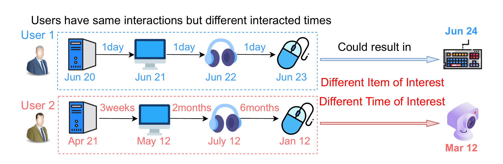
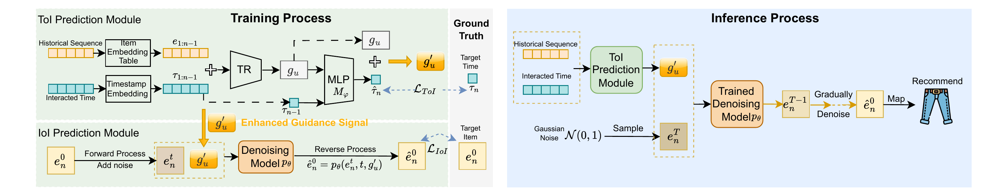

# PASRec - When and What to Recommend

**Nguồn:** Trích xuất từ mã nguồn LaTeX của bài báo "When and What to Recommend: Joint Modeling of Timing and Content for Active Sequential Recommendation" (Chai et al., arXiv:2511.18717).

Bài báo này chính là **mảnh ghép hoàn hảo** để biến project dự đoán thời gian (`delta_t_seconds`) của bạn thành một Hệ thống Gợi ý Chủ động (Active Recommendation System) hoàn chỉnh. Nó trả lời câu hỏi: *Không chỉ đoán khi nào khách quay lại, mà phải biết chính xác lúc đó nên đưa cho họ cái gì.*

---

## 1. Vấn đề của Sequential RecSys Hiện Tại

Các hệ thống Sequential Recommendation (như SASRec) hoạt động rất thụ động (Passive).

*Hình 1: Hai người dùng có lịch sử mua hàng giống hệt nhau, nhưng vì khoảng cách thời gian khác nhau nên dẫn đến Thời điểm quan tâm (ToI) và Sản phẩm quan tâm (IoI) hoàn toàn khác nhau.*

- **User 1 (Mua liền tù tì):** Mua Giày $\rightarrow$ Vài ngày sau mua Áo. Suy ra: Người này đang đi sắm đồ tập thể thao cường độ cao. Gợi ý tiếp theo là Vớ thể thao ngay trong tuần đó.
- **User 2 (Mua lai rai):** Mua Giày $\rightarrow$ Vài tháng sau mới mua Áo. Suy ra: Người này chỉ mua khi đồ cũ bị hỏng hoặc đổi mùa. Đừng gợi ý ngay. Đợi vài tháng nữa hẵng gợi ý Quần đùi.

$\rightarrow$ Nếu bỏ qua yếu tố thời gian thực (Real timestamps), mô hình sẽ đối xử với User 1 và User 2 giống hệt nhau. Đó là một sai lầm lớn.

---

## 2. Giải Pháp PASRec: Gộp chung ToI và IoI

PASRec (ProActive Sequential Recommendation) đặt ra hai khái niệm cốt lõi:

- **ToI (Time of Interest):** Thời điểm mà user muốn tương tác tiếp theo.
- **IoI (Item of Interest):** Món đồ mà user muốn vào đúng thời điểm ToI đó.

**Tại sao phải gộp chung (Joint Modeling)?**
Nếu bạn tách ra làm 2 mô hình (Mô hình 1 đoán Thời gian, Mô hình 2 đoán Item), thì sai số của Mô hình 1 sẽ lan truyền làm hỏng Mô hình 2 (gọi là *Single point of failure*). PASRec gộp chúng vào một Framework huấn luyện chung.

---

## 3. Kiến Trúc Của PASRec (The Framework)

Mã nguồn mô tả kiến trúc của PASRec chia làm 3 khối chính. Đây là bản thiết kế để bạn có thể clone/code theo:

*Hình 2: Kiến trúc của PASRec. Bên trái là Quá trình huấn luyện đồng thời ToI và IoI. Bên phải là Quá trình Suy luận (Inference).*

### Khối 1: Mã hóa Thời gian (Time Encoding Functions)

Khác với NLP chỉ mã hóa vị trí (1, 2, 3), PASRec phải mã hóa **Thời gian thực**. Bài báo đưa ra 3 hàm để bạn chọn (Section 3.2):

1. *Sinusoidal Function:* Mượn từ Transformer.
2. *Gaussian Kernel Function:* Dùng phân phối Gauss để đo khoảng cách thời gian.
3. *Random Fourier Feature (RFF):* Dùng chuỗi Fourier (Cách này thường bắt được tính chu kỳ rất tốt).

Các nhãn thời gian thực (Timestamps) được mã hóa thành các Vector thời gian ${\tau}$ và **cộng trực tiếp** vào Vector của Item $e$:
$\tilde{s}_u = [e_1 + \tau_1, e_2 + \tau_2, \dots, e_{n-1} + \tau_{n-1}]$

### Khối 2: ToI Prediction Module (Dự đoán Thời gian)

- Cho chuỗi $\tilde{s}_u$ chạy qua Transformer (để lấy User Representation $g_u$).
- Mô hình dùng $g_u$ và nhãn thời gian của hành vi cuối cùng ($\tau_{n-1}$) để **dự đoán Vector thời gian tiếp theo ($\hat{\tau}_{n}$)**.
- *Lưu ý quan trọng:* Nó dự đoán ra *Vector thời gian* chứ không phải là một con số giây cụ thể, giúp dễ dàng tích hợp vào mạng Neural.

### Khối 3: IoI Prediction Module bằng Diffusion (Dự đoán Sản phẩm)

Đây là phần "Deep Learning" hạng nặng của bài báo:

- Thay vì dùng lớp Softmax để phân loại (như truyền thống), họ dùng **Diffusion Model** (như Midjourney).
- Diffusion nhận **"Tín hiệu dẫn đường" (Guidance signal)** là sự kết hợp giữa Sở thích User ($g_u$) và Thời gian dự đoán ($\hat{\tau}_n$).
- Quá trình Denoising (Khử nhiễu) bắt đầu từ một Vector nhiễu ngẫu nhiên, từ từ gọt giũa để tạo ra một **Vector Sản Phẩm hoàn hảo (IoI)** phù hợp nhất với thời điểm ToI.

---

## 4. Hàm Loss (Loss Function) và Phân tích Toán học

Để buộc mô hình học cả thời gian và sản phẩm, PASRec tối ưu một **Joint Loss** (Section 3.5):
$\mathcal{L}_{\text{PASRec}} = \eta \mathcal{L}_{\text{IoI}} + (1 - \eta)\mathcal{L}_{\text{ToI}}$

Trong đó:

- $\mathcal{L}_{\text{ToI}}$: Ép Vector thời gian dự đoán phải sát với Vector thời gian thực tế.
- $\mathcal{L}_{\text{IoI}}$: Ép mô hình Diffusion khử nhiễu ra đúng sản phẩm thực tế (kết hợp với BPR Loss để Rank item đúng cao hơn item sai).

**Điểm ăn tiền về mặt Toán học (Proposition 1 & 2):**
Mã nguồn chứa các bằng chứng toán học (Proof) chứng minh rằng: Việc tối ưu hàm Loss này giúp **tối đa hóa Mutual Information** (Thông tin tương hỗ) giữa Thời gian và Sản phẩm.
Nói cách khác, nó chứng minh bằng toán học rằng: *"Nếu bạn biết rõ lúc nào khách định mua, bạn sẽ đoán chuẩn xác hơn khách muốn mua cái gì, so với việc bạn đoán lụi không cần biết thời gian."*

---

**TỔNG KẾT BÀI HỌC CHO DỰ ÁN CỦA BẠN:**

1. Dự án hiện tại của bạn (`delta_t_seconds`) tương đương với việc giải quyết **Khối 2 (ToI Prediction)** trong framework này.
2. Bài báo PASRec chứng minh rằng: Việc bạn dự đoán `delta_t` không phải là vô ích. Khi Vector `delta_t` đó được đưa vào làm **Condition (Điều kiện)** cho một mô hình sinh sản phẩm (Khối 3), độ chính xác của Hệ thống Gợi ý sẽ tăng vọt!
3. Nếu bạn muốn đưa project lên tầm cao mới, hãy đề xuất kiến trúc **ToI $\rightarrow$ Condition $\rightarrow$ IoI Generator** này vào phần Future Work trong báo cáo của bạn.
