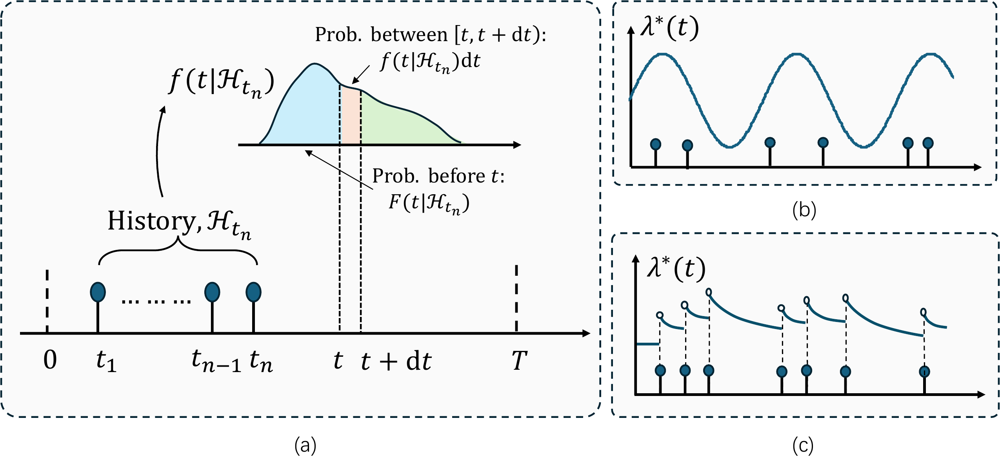
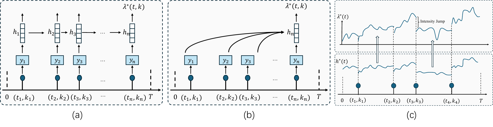
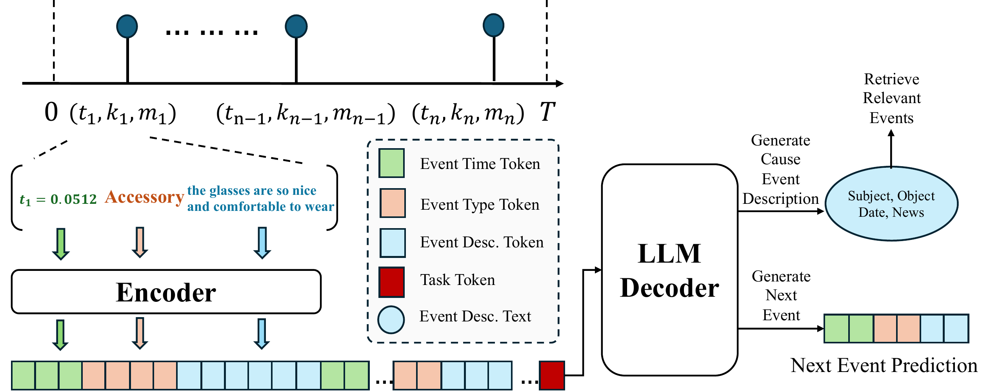

# Advances in Temporal Point Processes (Phần 1 - Nền tảng)

**Nguồn:** Trích xuất từ mã nguồn LaTeX của bài báo "Advances in Temporal Point Processes: Bayesian, Neural, and LLM Approaches" (Zhou et al., Tháng 1/2025, arXiv:2501.14291). 

Trong phần đầu tiên này, chúng ta sẽ làm rõ các khái niệm toán học cốt lõi của TPP, sự tiến hóa của nó qua các mạng Neural (Deep Learning), và cuộc cách mạng mới nhất khi đưa Mô hình Ngôn ngữ Lớn (LLMs) vào bài toán dự đoán thời gian.

---

## 1. Khái Niệm Lõi: Conditional Intensity Function (Hàm Cường Độ)

Bài toán cốt lõi của TPP là: **Tính xác suất khi nào một sự kiện tiếp theo sẽ xảy ra, dựa trên lịch sử các sự kiện đã qua.**

*Hình 1: Minh họa về hàm mật độ xác suất có điều kiện (conditional density) và hàm cường độ có điều kiện (conditional intensity) trong TPP.*

Thay vì dự đoán một con số `delta_t` rời rạc, TPP sử dụng một khái niệm mạnh mẽ hơn nhiều: **Hàm Cường độ $\lambda^*(t)$** (Hình c).

- **(b) Poisson Process (Quá trình Poisson):** Hàm cường độ chỉ phụ thuộc vào thời gian $t$, không quan tâm đến lịch sử. Nó như việc nói: "Buổi sáng khách mua hàng nhiều hơn buổi tối", bất chấp trước đó khách đã mua gì.
- **(c) Hawkes Process (Quá trình Hawkes):** Đây là "tiêu chuẩn vàng" cho RecSys. Mỗi khi một sự kiện xảy ra (những vạch màu xanh), nó tạo ra một cú "Bật" (Jump) làm tăng hàm cường độ lên. Sau đó, sự hưng phấn này giảm dần theo thời gian (Decay). Điều này mô phỏng hoàn hảo **Hiệu ứng Kích thích chéo (Self-exciting)**: *Khách vừa click xem đôi giày, thì xác suất khách click thêm một đôi giày nữa trong 5 phút tới là cực cao, nhưng sau 1 ngày thì xác suất này sẽ chìm nghỉm.*

Hàm cường độ của Hawkes Process được định nghĩa bằng công thức kinh điển:
$\lambda^*(t) = \mu + \sum_{t_n < t} \phi(t - t_n)$
Trong đó $\mu$ là sở thích nền (Base intensity), và $\phi$ là hàm kích thích từ các sự kiện quá khứ $t_n$.

---

## 2. Sự Nâng Cấp Từ Toán Học Sang Neural TPPs (Deep Learning)

Dùng các hàm toán học (như hàm phân rã mũ) cho Hawkes Process rất cứng nhắc. Do đó, các nhà nghiên cứu đã đưa Deep Learning vào để học các hàm Cường độ này một cách linh hoạt, tạo ra **Neural TPPs**.

*Hình 2: Ba kiến trúc chính của Neural TPPs: (a) Recurrent, (b) Autoregressive, và (c) Differential Equation.*

Bài báo phân loại Neural TPP thành 3 nhóm kiến trúc chính (Section 3):

1. **(a) Recurrent Neural TPPs (RNN-based):** Sử dụng mạng RNN/LSTM. Khi có sự kiện mới, trạng thái ẩn (hidden state) được cập nhật (màu xanh lá) và duy trì đi ngang cho đến sự kiện tiếp theo. Trạng thái ẩn này được dùng để tính toán hàm cường độ $\lambda^*(t)$ ở phía trên (đường màu xanh dương).
2. **(b) Autoregressive Neural TPPs (Transformer-based):** Cú hích lớn nhất. Thay vì truyền trạng thái tuần tự, mô hình Transformer tổng hợp *toàn bộ* lịch sử sự kiện cùng lúc bằng cơ chế Attention (các mũi tên màu đỏ). Nó bắt được các sự kiện lặp lại chu kỳ dài (Long-term dependencies) tốt hơn nhiều so với RNN.
3. **(c) Differential Equation-based (Dựa trên Phương trình Vi phân - NDEs):** Khác biệt hoàn toàn! Ở giữa hai sự kiện, trạng thái ẩn không nằm im (đường ngang) mà tự động biến đổi liên tục theo một phương trình đạo hàm riêng (đường cong màu xanh lá). Khi sự kiện xảy ra, nó tạo một bước "Nhảy" (Jump). Đây là mô phỏng sát nhất với cách não người quên dần thông tin.

---

## 3. Cuộc Cách Mạng Kỷ Nguyên Mới: LLM-based TPPs

Vấn đề của Neural TPPs (kể cả Transformer hay ODE) là chúng chỉ đọc được: `Thời gian (t) + Loại sự kiện (Event ID)`. Chúng bị "mù" trước dữ liệu Đa phương thức hoặc Ngữ nghĩa (Review, Text, Image). Năm 2024-2025, việc tích hợp LLM vào TPP bắt đầu bùng nổ.

*Hình 3: Tổng quan về LLM-based TPPs. Thời gian, Loại sự kiện và Dữ liệu đa phương thức được mã hóa thành Token để đút vào LLM. (Trích Hình 8)*

Các tác giả chia LLM-based TPP thành 2 trường phái chính:

### Trường phái 1: LLM-inspired TPPs (LLM làm phụ trợ)

- Vẫn dùng Neural TPP làm "bộ máy" tính toán thời gian chính.
- LLM được dùng để tạo ra các **Prompt thời gian (Temporal Prompts)** thích ứng với dữ liệu mới mà không cần huấn luyện lại toàn bộ mô hình (Continual Learning).
- Ví dụ: Mô hình *LAMP* dùng LLM để sinh ra "Lời giải thích" (Abductive reasoning) cho nguyên nhân tại sao sự kiện đó lại xảy ra, sau đó Neural TPP mới tính toán thời gian.

### Trường phái 2: Direct LLM-TPP Integration (Dùng LLM làm Lõi)

- Đưa LLM vào làm bộ máy xử lý chuỗi sự kiện chính.
- *Mô hình TPP-LLM (2024):* Thay vì dùng Event ID, nó dùng "Câu văn mô tả sự kiện". Thời gian được bơm vào thông qua "Temporal Positional Embeddings" (giống như Positional Encoding trong Transformer). Sau khi đọc xong, LLM bắn ra Vector cho một cái Đầu tính toán Cường độ (Intensity head) để dự đoán `delta_t`.
- **Sự Đột phá của Language-TPP (2025):** Đây chính là paper `2502.07139` (ByteToken) mà chúng ta đã tải ở bước trước! Nó không dùng Positional Encoding nữa. Nó biến trực tiếp các *Khoảng thời gian (Continuous time intervals)* thành các **Byte-level tokens** (Giống hệt như cách LLM token hóa chữ "Apple"). Lúc này, LLM xử lý cả thời gian và văn bản chung trong một luồng (Single token sequence). Mô hình không những đoán được khi nào khách click, mà còn sinh ra được câu văn giải thích quá trình đó!

---

**Lời kết Phần 1:**
Để dự đoán thời gian quay lại của người dùng (`delta_t_seconds`) trong Recommender Systems, chúng ta đã tiến hóa từ Hawkes Process toán học, đến Neural TPPs, và nay là **Language-TPP** (LLMs đọc hiểu thời gian).

Nếu Project của bạn đang ở mức Baseline Regression/Classification, bạn có thể hướng tới việc nâng cấp bằng **Neural TPPs (RNN/Transformer)**. Và việc đưa **Language-TPP** vào phần Future Direction của Project sẽ khiến hội đồng đánh giá hoàn toàn choáng ngợp trước tính cập nhật công nghệ SOTA (State-of-the-Art) của bạn!
